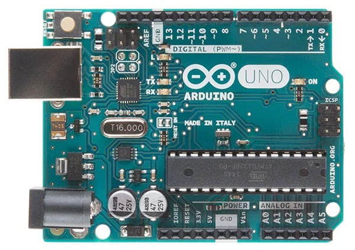
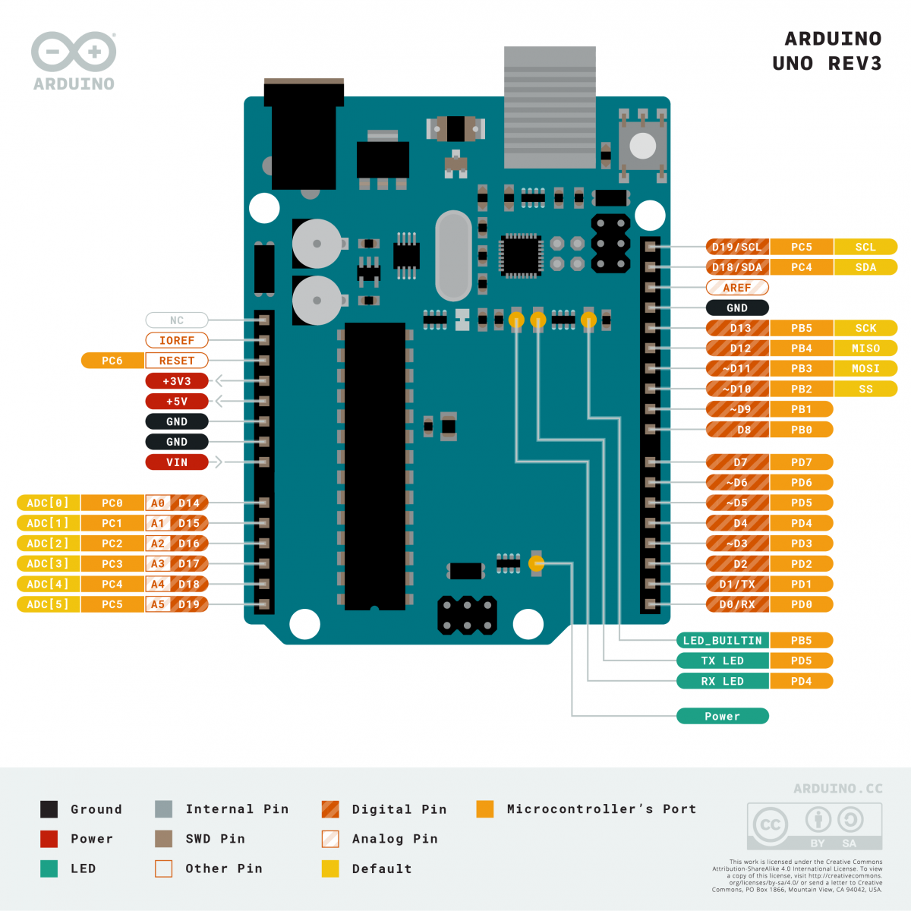

<h1>Introducción a Arduino</h1>

- [¿Qué es Arduino?](#qué-es-arduino)
- [Arduino UNO](#arduino-uno)
- [Instalación](#instalación)
  - [Paso 1: Descargar Arduino IDE](#paso-1-descargar-arduino-ide)
  - [Paso 2: Instalar](#paso-2-instalar)

## ¿Qué es Arduino?

Arduino es una plataforma de desarrollo basada en hardware y software libre diseñada para facilitar la creación de proyectos electrónicos interactivos. Permite controlar componentes electrónicos como LED, motores, sensores y más mediante programación en C/C++.

## Arduino UNO

La **Arduino UNO** es la placa de desarrollo más popular y accesible. 

Características principales:
- Microcontrolador ATmega328P
- 14 pines digitales (6 con PWM)
- 6 entradas analógicas
- Conexión USB para programación
- Voltaje operativo de 5V

## Instalación

### Paso 1: Descargar Arduino IDE
1. Accede a [arduino.cc](https://www.arduino.cc/en/software)
2. Descarga arduino IDE 1.8.X (Legacy) compatible con tu sistema operativo (Windows, Mac, Linux). **NO INSTALES LA NUEVA VERSIÓN 2.X.X**. Es más fácil usar la versión antigua en VS Code.

### Paso 2: Instalar
- **Windows**: Ejecuta el instalador  y sigue el asistente.

| Anterior | Índice | Siguiente |
|---|---|---|
|  | [Volver al índice](../README.md) | [Introducción a Proteus](Introduccion_Proteus.md) |