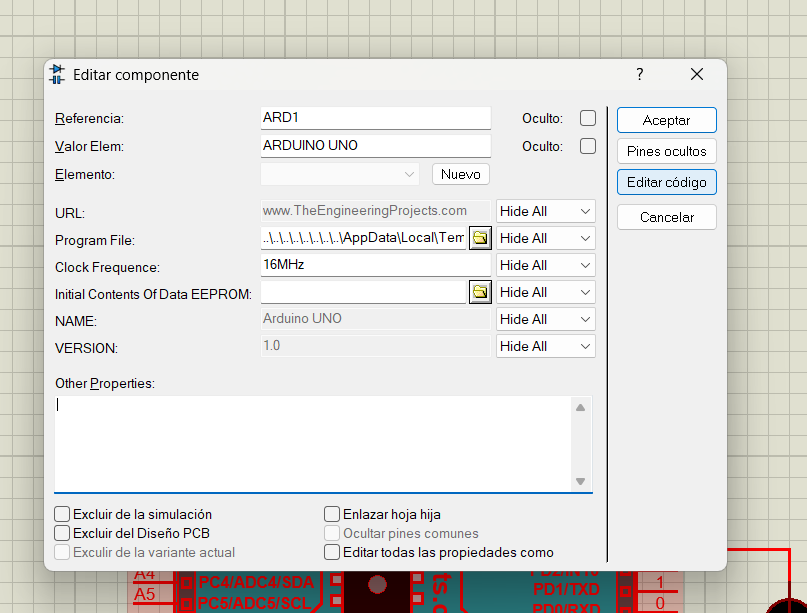
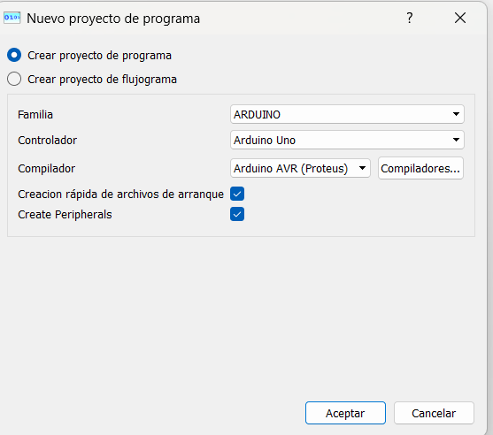
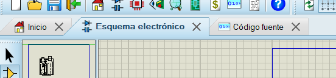
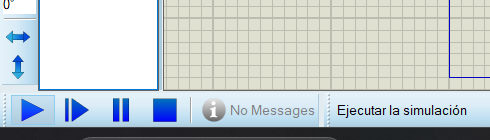

<h1>Introducción a Proteus</h1>

- [¿Qué es Proteus?](#qué-es-proteus)
- [Integración con Arduino](#integración-con-arduino)
  - [Instalación de archivos de Arduino](#instalación-de-archivos-de-arduino)
  - [Editar código en el simulador](#editar-código-en-el-simulador)

## ¿Qué es Proteus?

Proteus es un simulador profesional de circuitos electrónicos que permite diseñar, simular y verificar el funcionamiento de proyectos electrónicos sin necesidad de hardware físico. Es ideal para prototipado y educación en electrónica.

## Integración con Arduino

Proteus permite simular circuitos con Arduino UNO, lo que facilita:
- Probar código antes de implementarlo en hardware real
- Simular sensores y actuadores
- Validar convertidores analógico-digital y digital-analógico

### Instalación de archivos de Arduino

Para poder usar Arduino, es necesario copiar los archivos en la carpeta `LIBRARY`. 

Puedes dar clic derecho al acceso directo del escritorio y seleccionar `Abrir la ubicación del archivo`, lo que normalmente se abre en la dirección `C:\Program Files (x86)\Labcenter Electronics\Proteus 8 Professional\BIN`. 

Sube una carpeta arriba (`Proteus 8 Professional`) y ve a `...\Proteus 8 Professional\DATA\LIBRARY` y pega los archivos.

Una vez hecho eso, abre Proteus (cierralo si estaba abierto) y puedes usar Arduino y los proyectos de Proteus.

### Editar código en el simulador

Da doble clic en la tarjeta Arduino y selecciona en `Edit Firmware` o `Editar código` si está en español.

Luego selecciona la tarjeta a programar (puedes usar el que está por defecto) y da clic en aceptar.

Puedes cambiar le código existente por el que quieras.
Una vez que termines, vuelve a el Esquema electrónico

y finalmente, ejecuta la simulación con el botón de abajo a la izquierda.

| Anterior | Índice | Siguiente |
|---|---|---|
| [Introducción a Arduino](Introduccion_Arduino.md) | [Volver al índice](../README.md#temas-de-introducción) | [Formato de los proyectos en Visual Studio Code](Formato_proyectos.md) |