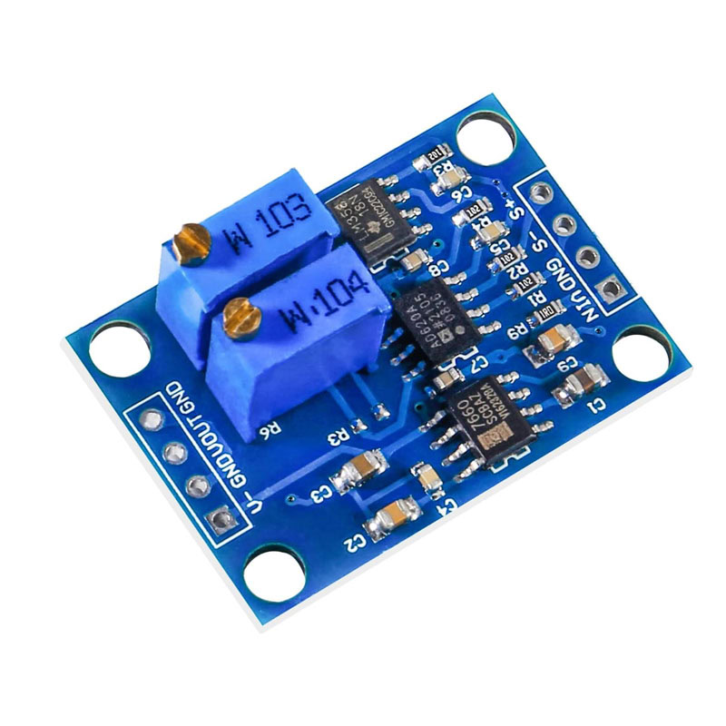
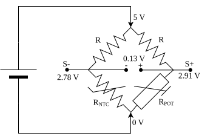

# Amplificador de instrumentación

En esta sección se introduce el amplificador de instrumentación como bloque de acondicionamiento para sensores que entregan señales diferenciales pequeñas. La idea es entender por qué no basta con un amplificador cualquiera y cómo este bloque se vuelve especialmente útil cuando un sensor resistivo, como un NTC dentro de un puente de Wheatstone, genera solo una diferencia de voltaje muy pequeña.

| Anterior | Índice | Siguiente |
|---|---|---|
| [Termistores](../9_Termistores/9_Termistores.md#termistores-ntc-y-ptc) | [Volver al índice](../README.md) | [Modelado y control de incubadora](../11_Modelado_y_control/11_Modelado_y_control.md) |

<h2>Índice</h2>

- [Amplificador de instrumentación](#amplificador-de-instrumentación)
	- [Objetivo](#objetivo)
	- [1. ¿Qué es un amplificador de instrumentación?](#1-qué-es-un-amplificador-de-instrumentación)
	- [2. ¿Por qué no basta un amplificador operacional simple?](#2-por-qué-no-basta-un-amplificador-operacional-simple)
	- [3. Puente de Wheatstone con NTC](#3-puente-de-wheatstone-con-ntc)
	- [4. Procedimiento de diseño y calibración](#4-procedimiento-de-diseño-y-calibración)
		- [Rango de temperatura recomendado](#rango-de-temperatura-recomendado)
		- [Elección de la resistencia de referencia del puente](#elección-de-la-resistencia-de-referencia-del-puente)
		- [Uso de la referencia externa de `3.3 V`](#uso-de-la-referencia-externa-de-33-v)
		- [Cálculo previo antes de calibrar](#cálculo-previo-antes-de-calibrar)
		- [Procedimiento práctico de calibración](#procedimiento-práctico-de-calibración)
		- [Validación final](#validación-final)
	- [5. Actividades](#5-actividades)

## Objetivo

Entender el funcionamiento básico de un amplificador de instrumentación y aplicarlo al acondicionamiento de un NTC conectado en un puente de Wheatstone para convertir una pequeña señal diferencial en una salida útil para un microcontrolador o instrumento de medición.

## 1. ¿Qué es un amplificador de instrumentación?



Un amplificador de instrumentación es un amplificador diferencial de alta precisión diseñado para medir diferencias pequeñas de voltaje entre dos nodos, incluso cuando ambos están montados sobre un nivel común relativamente grande (por ejemplo, la diferencia entre 3.31 V y 3.33 V es 0.02 V).

Su uso es muy común en instrumentación porque muchos sensores no entregan una señal fuerte respecto a tierra, sino una diferencia pequeña entre dos puntos del circuito. Ese es el caso de puentes resistivos, galgas extensiométricas, RTD, termopares amplificados y algunos acondicionamientos con NTC.

En la página de [NAYLAMP MECHATRONICS](https://naylampmechatronics.com/drivers/633-modulo-ad620-amplificador-de-instrumentacion.html) se puede encontrar información muy detallada de este dispositivo.

Sus características más importantes son:

- Alta impedancia de entrada.
- Buena estabilidad de ganancia.
- Alto rechazo al modo común.
- Genera su propio voltaje negativo
- Salida fácil de llevar a un ADC.

## 2. ¿Por qué no basta un amplificador operacional simple?

En principio, un amplificador operacional normal como el de la [práctica 5.2](../5_OpAmps_Basicos/OpAmps_Basicos.md#2-amplificadores) podría usarse para amplificar una señal pequeña. El problema es que en instrumentación no solo importa la ganancia, sino también qué tanto ruido común, offset y errores de resistencia se agregan al sistema.

Si los dos nodos del sensor tienen casi el mismo voltaje y la diferencia entre ellos es pequeña, un amplificador de instrumentación permite:

- amplificar principalmente la diferencia útil,
- rechazar mejor señales comunes a ambas entradas,
- evitar cargar con un alto voltaje o corriente excesivamente el puente o el sensor,
- y facilitar el ajuste de ganancia.

Por eso, este bloque aparece con frecuencia justo después de un [puente de Wheatstone](../8_Sensores/8_Sensores.md#2-puente-de-wheatstone).

## 3. Puente de Wheatstone con NTC



Como el puente de Wheatstone ya se explicó en la práctica de [sensores](../8_Sensores/8_Sensores.md#2-puente-de-wheatstone), aquí solo interesa cómo se usa como etapa de acondicionamiento para el NTC.

En este montaje, el NTC ocupa uno de los brazos variables y el potenciómetro permite ajustar el equilibrio del puente alrededor de una temperatura de interés. La salida útil no es el voltaje de un nodo respecto a tierra, sino la diferencia entre los nodos `S+` y `S-`:

$$
V_{bridge}=V_{exc}\left(\frac{R_{POT}}{R+R_{POT}}-\frac{R_{NTC}}{R+R_{NTC}}\right)
$$

Cuando el puente está balanceado, se cumple que $S^+ \approx S^-$ y por lo tanto $V_{bridge} \approx 0$. Si cambia la temperatura, cambia $R_{NTC}$, el puente se desequilibra y aparece una señal diferencial pequeña.

Eso es justamente lo que hace útil al puente en esta práctica: transforma un cambio pequeño de resistencia en una diferencia de voltaje que después puede amplificarse con un amplificador de instrumentación.

Aquí no conviene balancearlo necesariamente a `25 °C`, sino cerca de la temperatura real de trabajo. Si el sistema se diseñará para una zona alrededor de `40 °C`, entonces la resistencia de referencia y el ajuste del puente deben elegirse para que el equilibrio ocurra cerca de ese punto. Así, el desequilibrio alrededor del rango útil será pequeño, pero suficientemente sensible para que el amplificador lo expanda bien.

La cadena de medición queda así:

1. El NTC cambia su resistencia con la temperatura.
2. El puente convierte ese cambio en una diferencia de voltaje.
3. El amplificador de instrumentación amplifica esa diferencia.
4. El ADC mide una señal mucho más fácil de procesar.

## 4. Procedimiento de diseño y calibración

En esta práctica interesa más el proceso de calibración que la teoría aislada. La idea no es solo armar el circuito, sino diseñarlo para que el rango térmico útil ocupe casi todo el rango del ADC sin saturarlo.

### Rango de temperatura recomendado

Si el sistema está pensado para control térmico preciso de baja temperatura, no tiene mucho sentido diseñarlo para rangos muy altos. Un rango razonable es:

- Rango de control principal: `35 °C` a `42 °C`.
- Rango de diseño y protección: `30 °C` a `50 °C`.

Así se obtiene buena sensibilidad donde realmente importa, pero se conserva margen para detectar sobrecalentamiento o fallos.

Para un NTC de `10 kΩ` con beta aproximada de `3380`, algunos valores orientativos son:

| Temperatura | Resistencia aproximada |
|---|---|
| `30 °C` | `8.3 kΩ` |
| `35 °C` | `6.9 kΩ` |
| `41.1 °C` | `5.6 kΩ` |
| `42 °C` | `5.4 kΩ` |
| `50 °C` | `4.2 kΩ` |

Eso muestra algo importante: si el punto central de interés está cerca de `40 °C` a `42 °C`, no conviene necesariamente balancear el puente con `10 kΩ`, sino con una resistencia comercial del mismo orden que el NTC en ese punto. En este ejemplo se eligió directamente `5.6 kΩ`, y con ese valor el equilibrio del puente aparece cerca de `41.1 °C`.

### Elección de la resistencia de referencia del puente

Como se explicó en la [práctica pasada](../9_Termistores/9_Termistores.md#práctica-adicional-medición-con-excitación-por-pulsos), el NTC se va a excitar con pulsos para reducir autocalentamiento y además habrá compensación por software, por lo que se puede trabajar con resistencias moderadas sin necesidad de irse a valores extremadamente altos.

Una recomendación práctica es esta:

1. Elegir primero la temperatura central del rango útil.
2. Revisar la tabla del NTC o la hoja de datos para ver qué resistencia tiene el sensor cerca de esa temperatura.
3. Escoger una resistencia comercial cercana para armar el puente real.
4. En este caso se eligió la resistencia comercial de `5.6 kΩ`, que ubica el equilibrio del puente en aproximadamente `41.1 °C`.
3. Si se desea todavía menos autocalentamiento en medición continua, se pueden escalar todas las resistencias del puente a valores mayores manteniendo las proporciones.

La ventaja de la medición pulsada es que permite aumentar la sensibilidad sin mantener corriente continua sobre el termistor durante todo el tiempo.

### Uso de la referencia externa de `3.3 V`

En lugar de usar la referencia interna de `5 V` o de `1.1 V`, se puede conectar el pin `3.3 V` del Arduino directamente al pin `AREF`, con un capacitor de `100 nF` o más entre `AREF` y `GND`. Esto amplía el rango útil del ADC hasta `3.3 V` y no requiere ningún CI de referencia externo adicional.

En el código se activa con:

```cpp
analogReference(EXTERNAL); // antes de cualquier analogRead()
```

> ⚠️ No conectar ninguna fuente externa al pin `AREF` mientras `analogReference` esté en `DEFAULT` (5 V) — puede dañar el ADC del microcontrolador.

Con esta referencia, los objetivos de salida razonables son:

- Salida para temperatura mínima de diseño: `0.10 V`.
- Salida para temperatura máxima de diseño: `3.20 V`.

Eso deja un colchón de `0.10 V` en cada extremo para absorber tolerancias sin saturar el ADC.

### Cálculo previo antes de calibrar

El orden de trabajo recomendado es el siguiente:

1. Elegir $T_{min}$ y $T_{max}$ del diseño.
2. Elegir una resistencia comercial para el puente a partir de la tabla del NTC o de la hoja de datos, buscando que el equilibrio caiga cerca de la temperatura central del rango útil.
3. Obtener $R(T_{min})$ y $R(T_{max})$ con el modelo beta, con Steinhart-Hart o interpolando valores de la hoja de datos.
4. Sustituir esos valores y la resistencia comercial elegida en la [ecuación del puente](#3-puente-de-wheatstone-con-ntc) para obtener $V_{bridge}(T_{min})$ y $V_{bridge}(T_{max})$.
5. Elegir los voltajes objetivo a la salida del amplificador, por ejemplo `0.10 V` y `3.20 V`.
6. Calcular una primera ganancia con:

$$
G \approx \frac{V_{out,max}-V_{out,min}}{V_{bridge,max}-V_{bridge,min}}
$$

7. Calcular la referencia u offset de salida con:

$$
V_{ref} \approx V_{out,min}-G\,V_{bridge,min}
$$

Estas ecuaciones no reemplazan la calibración real, pero dan un punto de partida para no ajustar a ciegas.

También conviene conservarlas porque no solo sirven durante el diseño previo, sino también en el procesamiento dentro del microcontrolador. En otras palabras, una cosa es usar las ecuaciones para estimar una primera ganancia y un primer offset del circuito, y otra es usarlas después en el programa para convertir con buena precisión la lectura ADC en voltaje, el voltaje en desequilibrio del puente y, si se desea, ese desequilibrio en resistencia o temperatura.

La calibración experimental sigue siendo necesaria porque el circuito real introduce tolerancias en resistencias, offset residual, pequeñas diferencias de ganancia y variaciones del propio sensor. Pero esas correcciones experimentales no sustituyen al modelo matemático: más bien lo ajustan. Por eso, en una práctica completa conviene anotar ambos elementos:

- las ecuaciones nominales, para diseñar y programar el sistema,
- y los factores de calibración, para corregir el comportamiento real del montaje.

Aquí conviene distinguir dos ideas que no siempre coinciden:

- El cero del puente, que ocurre cuando $V_{bridge}=0$.
- El cero de salida del amplificador, que ocurre cuando $V_{out}=0$.

En general, el cero del puente fija una resistencia o temperatura de equilibrio del sensor, mientras que el cero de salida depende además de la ganancia y de la referencia $V_{ref}$ del amplificador. Por eso, si el sistema se diseña para trabajar entre `0.10 V` y `1.00 V`, no es obligatorio que la temperatura mínima útil corresponda a `0 V`. De hecho, muchas veces conviene reservar ese `0 V` para quedar fuera del rango normal de trabajo y dejar margen de seguridad.

Si se quiere estudiar exactamente cómo cambian esos puntos de equilibrio y de salida, puede usarse el script 

- [python/calibracion_puente_ntc.py](python/calibracion_puente_ntc.py):

Para este montaje, usando `5.6 kΩ` como resistencia comercial del puente, se obtiene el siguiente ejemplo numérico:

| Concepto | Descripción | Valor |
|---|---|---|
| Rango de diseño | Intervalo térmico usado para el cálculo inicial del puente y del amplificador. | `30.0 °C` a `50.0 °C` |
| Temperatura de equilibrio | Temperatura en la que el puente queda balanceado con la resistencia comercial elegida. | `41.1 °C` |
| Resistencia del NTC a 30.0 °C | Valor del termistor en el extremo inferior del rango de diseño. | `8294.6 Ω` |
| Resistencia del NTC a 35.0 °C | Valor intermedio útil para revisar la tendencia del sensor en la zona de control. | `6921.9 Ω` |
| Resistencia fija elegida para el puente | Resistencia comercial usada como referencia en el puente. | `5600.0 Ω` |
| Resistencia del NTC a 42.0 °C | Valor del termistor cerca del límite superior del rango de control. | `5425.2 Ω` |
| Resistencia del NTC a 50.0 °C | Valor del termistor en el extremo superior del rango de diseño. | `4160.1 Ω` |
| Salida del puente a temperatura mínima | Voltaje diferencial del puente cuando el sensor está en `30.0 °C`. | `-0.484830 V` |
| Salida del puente en equilibrio | Voltaje diferencial cuando el puente está exactamente balanceado. | `0.000000 V` |
| Salida del puente a temperatura máxima | Voltaje diferencial del puente cuando el sensor está en `50.0 °C`. | `0.368812 V` |
| Ganancia inicial sugerida | Ganancia estimada para expandir el rango útil hacia el ADC (`0.10 V` a `3.20 V`). | `3.6315` |
| Referencia de salida sugerida | Offset de salida necesario para ubicar la señal dentro de la ventana útil. | `1.860660 V` |
| Voltaje de salida con `R(50 °C)` sin offset | Lectura esperada durante la calibración al conectar `4160 Ω` con el trimmer de offset en cero. | `+1.3394 V` |
| Voltaje de salida con `R(30 °C)` sin offset | Lectura esperada durante la calibración al conectar `8295 Ω` con el trimmer de offset en cero. | `−1.7606 V` |
| Diferencia entre extremos (span de calibración) | Diferencia entre las dos lecturas anteriores; el trimmer de ganancia se ajusta hasta llegar aquí. | `3.10 V` |
| Salida del amplificador en equilibrio | Voltaje de salida cuando el puente está balanceado. | `1.860660 V` |
| Cero del puente | Punto donde la diferencia entre `S+` y `S-` es nula. | `5600.0 Ω`, `41.07 °C` |
| Cero de salida | Punto donde la salida del amplificador vale `0 V`. | `3695.0 Ω`, `53.71 °C` |

Este resultado deja ver que el equilibrio del puente sí depende de la resistencia comercial elegida y que el `0 V` de salida queda fuera del rango de trabajo cuando se reserva una ventana útil como `0.10 V` a `3.20 V` con referencia de `3.3 V` en el AREF del Arduino.

### Procedimiento práctico de calibración

La forma más limpia de calibrar no es con el NTC real desde el inicio, sino sustituyéndolo temporalmente por resistencias de precisión que representen temperaturas conocidas.

Por ejemplo, para el rango `30 °C` a `50 °C` se puede usar:

- una resistencia equivalente a `R(30 °C)`,
- y otra equivalente a `R(50 °C)`.

El procedimiento recomendado es:

1. Definir el rango térmico y elegir una temperatura central razonable dentro de ese rango.
2. Consultar la tabla del NTC o la hoja de datos y seleccionar una resistencia comercial cercana al valor del sensor en esa temperatura. En este ejemplo se eligió `5.6 kΩ`, por lo que el equilibrio quedó cerca de `41.1 °C`.
3. Desconectar el sensor y unir las dos entradas del amplificador de instrumentación para forzar un voltaje diferencial de `0 V`.
4. Con la referencia del amplificador en `0 V` o en su configuración de cero inicial, ajustar el offset interno (con un destornillador de relojero, ajustar el trimmer que cambia el voltaje linealmente) hasta que la salida sea `0 V` o lo más cercana posible.
5. Si se desea verificar el cero con más sensibilidad, aumentar temporalmente la ganancia (con el trimmer que cambia el voltaje exponencialmente) y confirmar que la salida sigue cerca de cero cuando ambas entradas están cortocircuitadas.
6. Conectar la resistencia equivalente a `R(50 °C)` = `4160 Ω` y anotar la lectura. Conectar después `R(30 °C)` = `8295 Ω` y anotar la segunda. Con el trimmer de offset en `0 V`, ajustar el **trimmer de ganancia** hasta que la diferencia entre ambas lecturas sea `3.10 V` (= `3.20 V − 0.10 V`). Con la ganancia correcta las lecturas serán aproximadamente `+1.34 V` con `4160 Ω` y `−1.76 V` con `8295 Ω`.
7. Sin tocar el trimmer de ganancia, conectar nuevamente `4160 Ω` y ajustar el **trimmer de offset** hasta que la salida llegue a `3.20 V`. Esto añade el desplazamiento de `+1.86 V` necesario para centrar el rango sobre la ventana del ADC.
8. Verificar que con `8295 Ω` la salida esté en `0.10 V`. Repetir los pasos anteriores si alguno de los dos extremos está fuera del margen deseado.

Normalmente hay que iterar. En la práctica, el balance del puente, la ganancia y el offset no quedan completamente desacoplados, así que el ajuste final suele requerir dos o tres pasadas.

### Validación final

Una vez calibrado el sistema con resistencias equivalentes, se vuelve a colocar el NTC real y se comprueba el comportamiento en varios puntos de temperatura.

La validación final ideal es:

1. medir la temperatura con una referencia externa razonable o un sensor de temperatura bien calibrado,
2. registrar el voltaje de salida del amplificador,
3. convertirlo en temperatura por software,
4. y verificar que el rango útil quede bien distribuido dentro de `0.10 V` a `3.20 V` aproximadamente.

## 5. Actividades

1. Realiza los cálculos para utilizar el NTC con el puente de Wheatstone y el amplificador de instrumentación
2. Calíbralo con el equipo real
3. Haz un código de Arduino que aproveche los cálculos hechos anteriormente y haz que imprima la temperatura en una pantalla LCD 20x4 i2C o puedes usar temporalmente el puerto serial para imprimir en la computadora los valores
4. Verifica que las mediciones de temperatura sean correctas con otro sensor de temperatura calibrado

| Anterior | Índice | Siguiente |
|---|---|---|
| [Termistores](../9_Termistores/9_Termistores.md#termistores-ntc-y-ptc) | [Volver al índice](../README.md) | [Modelado y control de incubadora](../11_Modelado_y_control/11_Modelado_y_control.md) |
