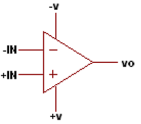
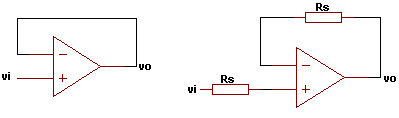
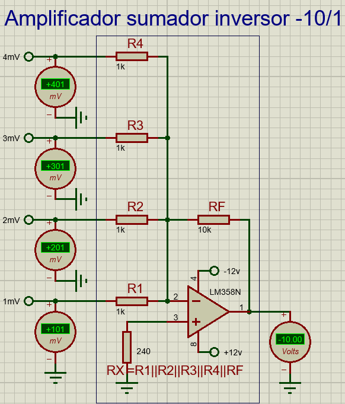
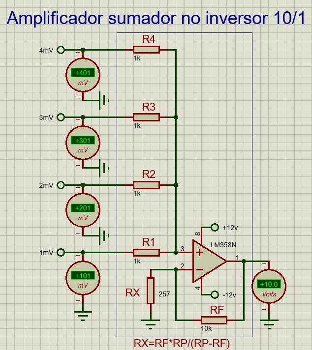
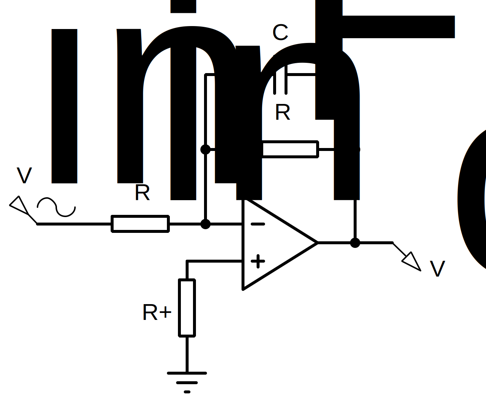
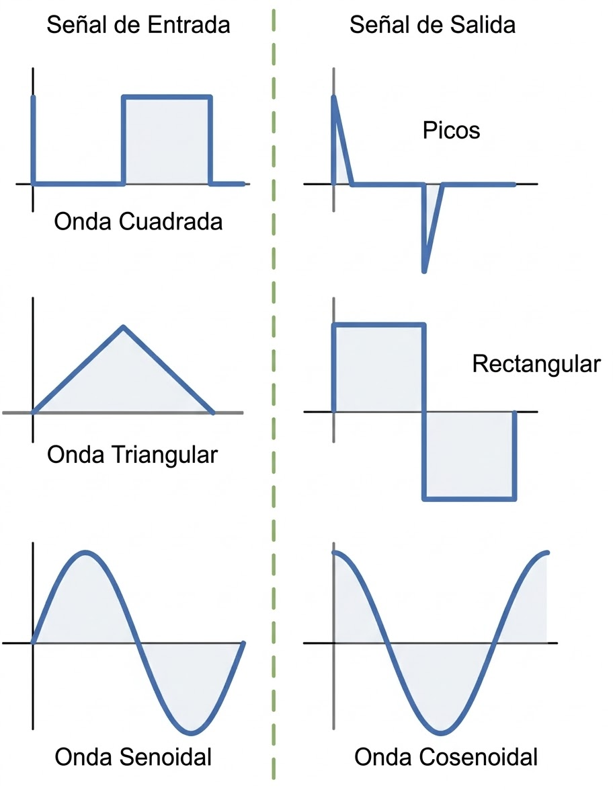
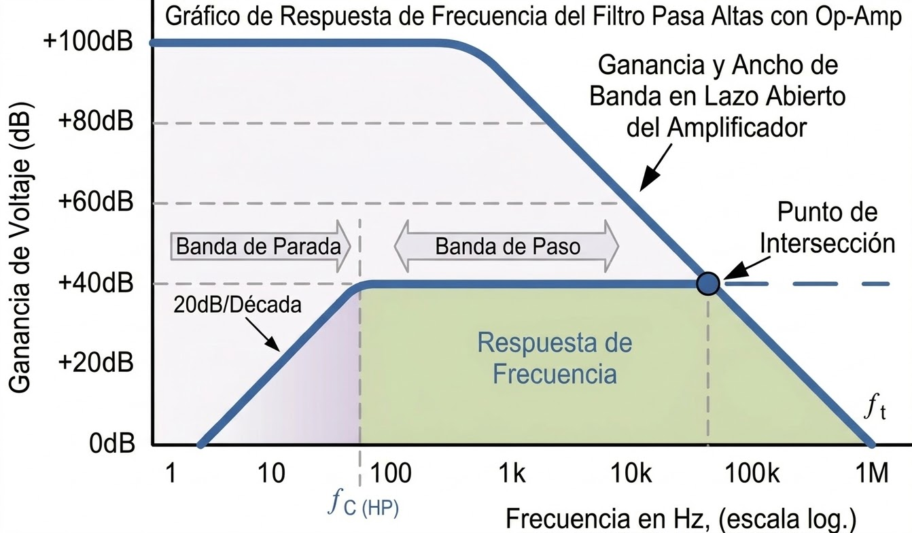

<h1>Amplificadores operacionales básicos</h1>

Esta sección es más técnica que las anteriores, ya que tiene como objetivo entender las configuraciones básicas de un amplificador operacional. En este caso, no se programará nada en Arduino, pero sí se realizarán cambios en las resistencias para entender las ecuaciones matemáticas.

> Subirán los **videos** de cada archivo de Proteus resolviendo las preguntas y explicando el funcionamiento de los problemas resueltos.

<h2>Índice</h2>

- [Archivos](#archivos)
- [Tipos de circuitos integrados](#tipos-de-circuitos-integrados)
  - [1. LM741 (Obsoleto)](#1-lm741-obsoleto)
  - [2. LM358 y LM324 (Uso general)](#2-lm358-y-lm324-uso-general)
  - [3. LM339 y LM393 (Especialistas en comparar)](#3-lm339-y-lm393-especialistas-en-comparar)
  - [4. TL081 y TL082](#4-tl081-y-tl082)
- [Aplicaciones clásicas](#aplicaciones-clásicas)
  - [1. Básicos](#1-básicos)
    - [1.1. Comparador](#11-comparador)
    - [1.2. Seguidor de voltaje](#12-seguidor-de-voltaje)
    - [Prueba sugerida](#prueba-sugerida)
  - [2. Amplificadores](#2-amplificadores)
    - [2.1. Amplificador inversor](#21-amplificador-inversor)
    - [Ejercicio](#ejercicio)
    - [2.2. Amplificador No inversor](#22-amplificador-no-inversor)
  - [3. Amplificador sumador/restador](#3-amplificador-sumadorrestador)
    - [3.1. Amplificador sumador inversor](#31-amplificador-sumador-inversor)
    - [3.2. Amplificador sumador no inversor](#32-amplificador-sumador-no-inversor)
    - [3.3. Amplificador sumador restador](#33-amplificador-sumador-restador)
    - [Ejercicio](#ejercicio-1)
  - [4. Filtros (Derivador e integrador)](#4-filtros-derivador-e-integrador)
    - [4.1. Integrador (filtro pasa bajas)](#41-integrador-filtro-pasa-bajas)
    - [4.2. Derivador (filtro pasa altas)](#42-derivador-filtro-pasa-altas)
    - [Derivador-Integrador (Filtro pasa banda)](#derivador-integrador-filtro-pasa-banda)
    - [Integrador-Derivador (Filtro rechaza banda)](#integrador-derivador-filtro-rechaza-banda)

## Archivos

Se dividirán los OpAmps en 4 archivos según su tipo:
- [Comparador y seguidor de voltaje](OpAmps_basicos_1_Comparador_y_seguidor.pdsprj)
- [Amplificadores](OpAmps_basicos_2_Amplificadores.pdsprj)
- [Sumadores](OpAmps_basicos_3_Sumador.pdsprj)
- [Integrador y derivador](OpAmps_basicos_4_integrador_y_derivador.pdsprj)

## Tipos de circuitos integrados

Existen distintos modelos que se suelen utilizar para las prácticas, entre los que se encuentran los siguientes:

### 1. LM741 (Obsoleto)

El LM741 es el más famoso, pero para instrumentación moderna es pésimo. Problema: No es "Rail-to-Rail". Si lo alimentas con 5 V, su salida máxima será de unos 3.5 V y la mínima de 1.5 V. Además, requiere fuente simétrica (+15 V y -15 V) para funcionar bien.

> Uso: Solo para enseñar historia de la electrónica o circuitos con voltajes muy altos y no se usará en el curso.

### 2. LM358 y LM324 (Uso general)

El LM358 (2 OpAmps en el encapsulado) y el LM324 (4 OpAmps en el encapsulado) son los más usados en prácticas generales como Arduino.

Ventaja "Single Supply": Pueden funcionar solo con GND y 5 V, lo que permite llegar casi a 0 V (GND), lo cual es vital para leer sensores que empiezan en cero. 

Su salida en voltaje positivo disminuye un poco (con 12 V de entrada puede dar 10.5 V de salida), pero en voltaje negativo es casi la misma en la entrada que en la salida máxima;

> Son ideales para el DAC R-2R y filtros.

### 3. LM339 y LM393 (Especialistas en comparar)

> Estos NO son OpAmps, son COMPARADORES.

Diferencia crucial: Un OpAmp intenta mantener un equilibrio. Un comparador es "violento": su salida es Colector Abierto. 

¿Qué significa? Que la salida no da voltaje por sí sola; es como un interruptor que conecta a tierra. 

Necesitas una resistencia de pull-up a 5 V para que el Arduino pueda leer un "1".

Uso: Son muchísimo más rápidos que un OpAmp para el convertidor analógico-digital rápido (ADC Flash) y el convertidor analógico-digital de aproximación sucesiva (ADC SAR). Si usas un LM358 como comparador, será lento y la señal se verá "redondeada".

### 4. TL081 y TL082
Son OpAmps con entrada JFET, por lo que no consumen nada de corriente del colector, lo que los hace ideales para sensores extremadamente sensibles.

> El TL081 contiene un solo OpAmp, mientras que el TL082 tiene dos.

## Aplicaciones clásicas

### 1. Básicos

#### 1.1. Comparador

Primero resta el valor de la entrada no inversora (+) con la entrada inversora (-) y si el resultado es positivo, la salida es el voltaje máximo positivo, mientras que si el resultado es negativo, la salida es el voltaje máximo negativo

Esto la forma más sencilla de convertir una entrada analógica a una digital.

Este ejercicio se resuelve completando [OpAmps_basicos_1_Comparador_y_seguidor.pdsprj](OpAmps_basicos_1_Comparador_y_seguidor.pdsprj).

**Prueba**

- Cambia el valor del sensor de temperatura y del potenciómetro y verifica su funcionamiento.

#### 1.2. Seguidor de voltaje

El voltaje de salida sigue a la entrada casi con el mismo valor.

También sirve como **buffer**: aísla etapas (alta impedancia de entrada y baja de salida). Esto es muy útil para sensores basados en resistencia o cuando un cambio en las resistencias usadas para la configuración de los OpAmps pueden alterar los valores del sensor.

Si existe una resistencia de entrada $R_s$, puede usarse una resistencia en la retroalimentación para eliminar el sesgo de corriente y balancear el circuito en aplicaciones más precisas.

Esta práctica se encuentra en [OpAmps_basicos_1_Comparador_y_seguidor.pdsprj](OpAmps_basicos_1_Comparador_y_seguidor.pdsprj).

#### Prueba sugerida
- Mueve el valor el potenciómetro para cambiar el voltaje de entrada y verifica que la salida cambie igual.

### 2. Amplificadores

#### 2.1. Amplificador inversor

Como su nombre lo indica, amplifica el voltaje en función de la configuración de las resistencias. Utiliza la entrada inversora ($-$)

También la salida se invierte respecto a la entrada (180° de desfase en CA). Eso significa que si la entrada es un voltaje positivo, la salida es negativo y viceversa.

La ganancia usa un factor:

$$G = -\frac{R_F}{R_1}$$

También se suele poner una resistencia RX que sirve para balancear el circuito eliminando el sesgo de corriente, útil en aplicaciones más precisas. Su ecuación es:

$$RX = R_F||R_1 = \frac{1}{\frac{1}{R_F} + \frac{1}{R_1}}$$

Recordemos que el símbolo $R_A||R_B$ se suele utilizar para dos resistencias en paralelo.

El archivo se encuentra en [Archivo de Proteus de OpAmps básicos con 2 Amplificadores](OpAmps_basicos_2_Amplificadores.pdsprj).

#### Ejercicio

- Cambia los valores del potenciómetro para ver cómo cambia.
- Haz que se amplifique en un factor de 5 veces.
- Responde a las preguntas que aparecen en el circuito.

#### 2.2. Amplificador No inversor

Es el equivalente del anterior, pero la salida mantiene la fase de la entrada.

La amplificación es ligeramente más complicada al usar la entrada no inversora.

La ganancia usa un factor:

$$G = 1+\frac{R_F}{R_1}$$

También se suele poner una resistencia $R_X$ para balancear el circuito, cuya ecuación es:

$$R_X = R_F||R_1$$

El archivo se encuentra en [Archivo de Proteus de OpAmps básicos con 2 Amplificadores](OpAmps_basicos_2_Amplificadores.pdsprj).

**Ejercicio**

- Cambia los valores del potenciómetro para ver cómo cambia.
- Haz que se amplifique en un factor de 5 veces.
- Responde a las preguntas que aparecen en el circuito.

### 3. Amplificador sumador/restador

El Amplificador sumador/restador, como su nombre indica, primero amplifica cada entrada y luego las suma o resta dependiendo de si se encuentran en la entrada no inversora ($+$) o en la inversora ($-$). 

Se recomienda que cada entrada pase por un seguidor o buffer, ya que al tener una malla compleja de resistencias, los cálculos se vuelven más complicados e inestables, por lo que es más fácil estabilizar los voltajes con el seguidor.

El caso general es el Amplificador sumador-restador que se muestra en la siguiente imagen, pero se irán viendo casos más específicos y útiles. 

Para un circuito sumador/restador con múltiples entradas ponderadas:

$$V_{out} = \sum_{i=1}^n G_i V_i = G_1 V_1 + G_2 V_2 + \dots + G_n V_n$$

donde:
- $R_i = \frac{R_F}{G_i}$ es la resistencia de entrada para cada ganancia
- $V_{out}$ es el voltaje de salida
- $R_F$ es la resistencia de retroalimentación. Idealmente, $R_F$ debe ser un múltiplo de $\sum G_i$ o la sumatoria de todas las ganancias (positivas en suma y negativas en resta).

El archivo de Proteus donde se trabajará es [Archivo de Proteus de OpAmps básicos 3: Sumador](OpAmps_basicos_3_Sumador.pdsprj).

#### 3.1. Amplificador sumador inversor

En su modo inversor (desfasado 180°), se usa la entrada inversora y la ecuación es muy parecida a la del [amplificador inversor](#21-amplificador-inversor) normal, solo que la amplificación se puede aplicar en cada entrada. 

Como se explicó anteriormente, $R_i = \frac{R_F}{G_i}$, por lo que se puede despejar para calcular el valor deseado.

La resistencia $R_X$ se usa para balancear la corriente del circuito, por lo que se recomienda ponerla con el valor de las demás resistencias en paralelo, pero no va a alterar mucho el voltaje resultante.

$$R_X = R_1||R_2||\cdots||R_n||R_F$$

#### 3.2. Amplificador sumador no inversor

En este caso, se usa la entrada no inversora; no habrá desfase y los cálculos de $R_F$, $R_i$ y $G_i$ serán iguales, pero la resistencia $R_X$, además de balancear la corriente, también balancea el voltaje, por lo que debe usarse una resistencia más precisa. 

$$R_X = \frac{R_F R_P}{R_F - R_P}$$

donde $R_P$ es el paralelo de las resistencias de entrada

$$R_P = R_1||R_2||\cdots||R_n$$

#### 3.3. Amplificador sumador restador

Es la versión completa de los casos anteriores.

Para un circuito sumador/restador con múltiples entradas ponderadas:

$$V_{out} = \sum_{i=1}^n G_i V_i = G_1 V_1 + G_2 V_2 + \dots + G_n V_n$$

donde:
- $R_i = \frac{R_F}{G_i}$ es la resistencia de entrada para cada ganancia
- $V_{out}$ es el voltaje de salida
- $R_F$ es la resistencia de retroalimentación. Idealmente, $R_F$ debe ser un múltiplo de $\sum G_i$.

**Resistencia de Balance ($R_x$)**

El cálculo de $R_x$ depende de la suma ponderada de ganancias:

$$\sum G_i = \sum_{+} G_i - \sum_{-} G_i$$

Existen tres casos especiales:

$$
R_x = \begin{cases}
  R_F & \text{si } \sum G_i = 0 \text{ → Se conecta a no inversora}\\
  0  & \text{si } \sum G_i = -1 \text{ → No inversora a tierra sin resistencia}\\
  \frac{R_F}{1 + \sum G_i} & \text{caso general → Se conecta en el signo contrario}
\end{cases}
$$

Pueden basarse en la imagen, donde se muestra el signo de la resistencia $R_x$.

#### Ejercicio

- Conecta 2 entradas positivas y 4 negativas con la ganancia $G=10$ de cada entrada ya asignada y calcula la resistencia $R_X$. Verifica que el resultado es correcto.
- Ahora conecta 2 entradas negativas y 4 positivas con una ganancia $G=10$ en cada entrada. De ser posible, intenta que las resistencias no usen decimales infinitos usando múltiplos. 

### 4. Filtros (Derivador e integrador)

En estas configuraciones, el OpAmp realiza dos operaciones matemáticas fundamentales: derivación (cambio rápido de voltaje) e integración (acumulación de voltaje). Se usan condensadores para almacenar o liberar carga, lo que produce estos efectos.

Se les dice filtros porque amplifican o atenúan el voltaje dependiendo de qué tan rápido cambia la señal de entrada (frecuencia) y la configuración.

#### 4.1. Integrador (filtro pasa bajas)
Realiza la operación matemática de integración. Es decir, el voltaje de salida es la integral del voltaje de entrada. Usualmente, se representa con una bobina porque almacena voltaje en forma de campo eléctrico.

En este caso, el voltaje resultante se obtiene con la ecuación:

$$
V_{out}(t) = -\frac{R}{L} \int V_{in}(t)dt + k
$$

Donde $k$ representa la condición inicial del voltaje almacenado en forma de campo magnético.

El inconveniente de las bobinas es que es difícil miniaturizarlas para ponerlas en circuitos integrados. Además, el campo magnético puede influir en otras partes del circuito, por lo que normalmente se usan condensadores con la siguiente configuración:

Cuya ecuación es:

$$
V_{\text{out}}(t) = -\frac{1}{RC}\int V_{in}(t)dt + k
$$

Donde $k$ representa la carga inicial del condensador. 

El problema en este caso es que mientras más baja la frecuencia de cambio del voltaje (lo cual se nota aún más en corriente directa), más amplifica hasta el punto de que el condensador se satura y ya no integra. Esto no se puede solucionar, pero se puede usar una resistencia para limitar la ganancia en CC del integrador usando la configuración del [amplificador inversor](#21-amplificador-inversor).

El nuevo circuito queda de la siguiente manera:

Cuya ecuación aproximada es:

$$
V_{\text{out}}(t) = -\frac{1}{R_{\text{in}}C}\int V_{\text{CA}}(t)dt - \frac{R_F}{R_{\text{in}}}V_{\text{CC}}
$$

Donde $V_{\text{CA}}$ es la componente de corriente alterna de la señal de entrada y $V_{\text{CC}}$ es la componente de corriente directa de la señal de entrada. Por lo tanto, si la señal de entrada no tiene componente CC la señal de salida es la siguiente:

$$
V_{\text{out}}(t) = -\frac{1}{RC}\int V_{\text{CA}}(t)dt
$$

Y si la entrada no tiene componente CA, la señal es la siguiente

$$
V_{\text{out}}(t) = - \frac{R_F}{R}V_{\text{CC}}
$$

**Qué conectar**
- Configuración inversora con condensador en realimentación.

**Qué observar**
- Con onda cuadrada de entrada, la salida tiende a forma triangular.
- La frecuencia afecta qué tan rápido cambia la salida.

**Prueba sugerida**
- Mantén amplitud y cambia frecuencia para ver la diferencia.

#### 4.2. Derivador (filtro pasa altas)

Realiza la operación matemática de derivación; es decir, el voltaje de salida es la derivada del voltaje de entrada.

En este caso, el voltaje resultante se obtiene con la ecuación:

$$
V_{\text{out}} = -RC\frac{dV_{\text{in}}(t)}{dt}
$$

Y dependiendo de la señal que de entrada, puede responder de la siguiente forma:

También se le llama **filtro pasa altas** porque si denotamos la derivada del voltaje como la velocidad del cambio del voltaje, si el voltaje de entrada cambia a baja velocidad, por ejemplo, voltaje constante o frecuencia de cambio baja, el voltaje de salida es $0$ o un valor atenuado respectivamente, mientras que si la velocidad o frecuencia de cambio es muy alta, no solo la deja pasar, sino que la amplifica. Por eso se dice que deja pasar las altas frecuencias (pasa altas) y atenúa las bajas.

El problema de esto es que si el ruido tiene una alta frecuencia, también lo amplifica más que la señal que queremos derivar.

Es por ello que la configuración cambia a la siguiente:

Donde el voltaje de salida es:

$$
V_{\text{out}}(t) = -RC\frac{dV_{\text{in}}(t)}{dt} - \frac{R_F}{R_{\text{in}}}V_{\text{HF}}(t)
$$

Donde:

$$
\begin{align*}
  V_{\text{in}}: & \text{ Señal de entrada.} \\
  V_{\text{HF}}: & \text{ Señal de ruido con } \frac{f_\text{ruido}}{f_{\text{in}}}
\end{align*}
$$

(Obtenido de [Electronics Tutorials](https://www.electronics-tutorials.ws/filter/filter_6.html))

**Qué conectar**
- Configuración inversora con condensador en la entrada.

**Qué observar**
- Resalta cambios rápidos de la señal.
- Con onda triangular, la salida se parece más a una cuadrada.

**Prueba sugerida**
- Compara su comportamiento con el integrador para la misma entrada.

#### Derivador-Integrador (Filtro pasa banda)

#### Integrador-Derivador (Filtro rechaza banda)

| Anterior | Índice | Siguiente |
|---|---|---|
| [Entrada analógica](../4_Entrada_Analogica/Entrada_Analogica.md) | [Volver al índice](../README.md#prácticas-usando-amplificadores-operacionales) | [ADC por suma ponderada](../6_ADC_suma_ponderada/ADC_suma_ponderada.md) |
