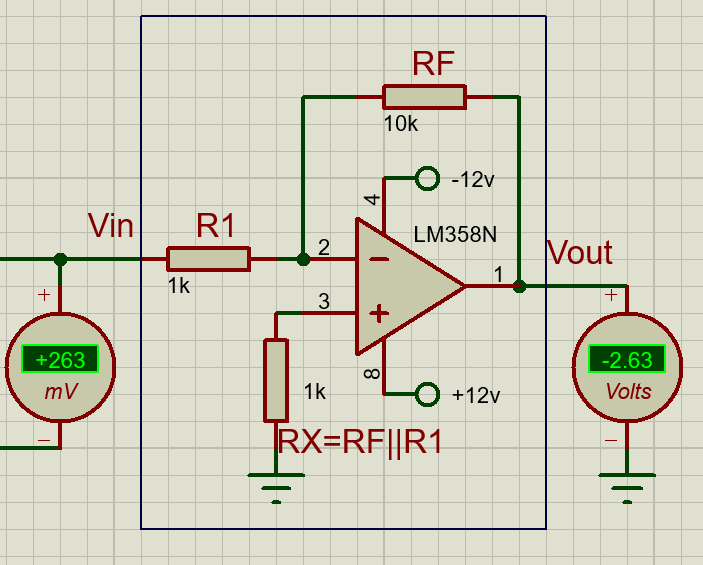
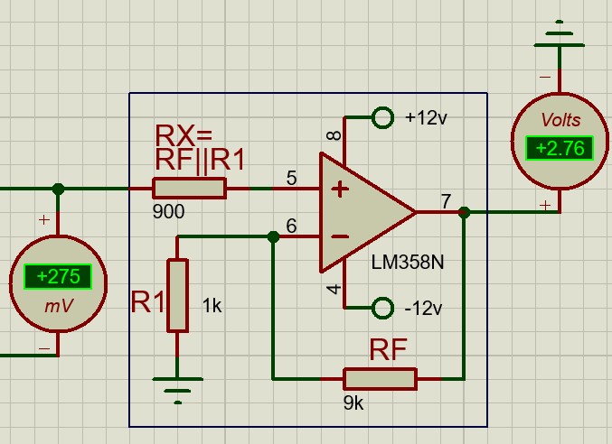

<h1>Amplificadores operacionales básicos</h1>

Esta sección es más técnica que las anteriores ya que tiene como objetivo entender las configuraciones básicas de un amplificador operacional. En este caso, no se programará nada en Arduino, pero sí se realizarán cambios en las resistencias para entender las ecuaciones matemáticas.

<h2>Índice</h2>

- [Archivos](#archivos)
- [Tipos de circuitos integrados](#tipos-de-circuitos-integrados)
  - [1. LM741 (Obsoleto)](#1-lm741-obsoleto)
  - [2. LM358 y LM324 (Uso general)](#2-lm358-y-lm324-uso-general)
  - [3. LM339 y LM393 (Especialistas en comparar)](#3-lm339-y-lm393-especialistas-en-comparar)
  - [4. TL081 y TL082](#4-tl081-y-tl082)
- [Aplicaciones clásicas](#aplicaciones-clásicas)
  - [1) Comparador](#1-comparador)
  - [2) Seguidor de voltaje](#2-seguidor-de-voltaje)
  - [3) Amplificador Inversor](#3-amplificador-inversor)
  - [4) Amplificador No inversor](#4-amplificador-no-inversor)
  - [5) Sumador inversor](#5-sumador-inversor)
  - [6) Sumador no inversor](#6-sumador-no-inversor)
  - [7) Restador](#7-restador)
  - [8) Integrador](#8-integrador)
  - [9) Derivador](#9-derivador)
- [Qué deben entregar](#qué-deben-entregar)

## Archivos

Se dividirán los OpAmps en 4 archivos según su tipo_
- [Comparador y seguidor de voltaje](OpAmps_basicos_1_Comparador_y_seguidor.pdsprj)
- [Amplificadores](OpAmps_basicos_2_Amplificadores.pdsprj)
- [Sumadores](OpAmps_basicos_3_Sumador.pdsprj)
- [Integrador y derivador](OpAmps_basicos_4_integrador_y_derivador.pdsprj)

## Tipos de circuitos integrados

Existen distintos modelos que se suelen utilizar para las prácticas, entre los que se encuentran los siguientes:

### 1. LM741 (Obsoleto)

El LM741 es el más famoso, pero para instrumentación moderna es pésimo.Problema: No es "Rail-to-Rail". Si lo alimentas con 5V, su salida máxima será de unos 3.5V y la mínima de 1.5V. Además, requiere fuente simétrica ($+15V$ y $-15V$) para funcionar bien.

> Uso: Solo para enseñar historia de la electrónica o circuitos con voltajes muy altos y no se usará en el curso.

### 2. LM358 y LM324 (Uso general)

El LM358 (2 OpAmps en el encapsulado) y el LM324 (4 OpAmps en el encapsulado) son los más usados en prácticas generales como Arduino.

Ventaja "Single Supply": Pueden funcionar solo con $GND$ y $5V$. Su salida en voltaje positivo disminuye un poco (con $12V$ de entrada puede dar $10.5V$ de salida), pero en voltaje negativo es casi la misma en la entrada que en la salida máxima; también puede llegar casi a $0V$ (GND), lo cual es vital para leer sensores que empiezan en cero.

> Son ideales para el DAC R-2R y filtros.

### 3. LM339 y LM393 (Especialistas en comparar)

> Estos NO son OpAmps, son COMPARADORES.

Diferencia crucial: Un OpAmp intenta mantener un equilibrio. Un comparador es "violento": su salida es Colector Abierto. 

¿Qué significa? Que la salida no da voltaje por sí sola; es como un interruptor que conecta a tierra. 

Necesitas una resistencia de pull-up a 5V para que el Arduino pueda leer un "1".Uso: Son muchísimo más rápidos que un OpAmp para el ADC Flash y el ADC SAR. Si usas un LM358 como comparador, será lento y la señal se verá "redondeada".

### 4. TL081 y TL082
Son OpAmps con entrada JFET, por lo que no consumen nada de corriente del colector, lo que los hace ideales para sensores extremadamente sensibles.

> El TL081 contiene un solo OpAmp, mientras que el TL082 tiene dos.

## Aplicaciones clásicas

### 1) Comparador

Primero resta el valor de la entrada no inversora (+) con la entrada inversora (-) y si el resultado es positivo, la salida es el voltaje máximo positivo, mientras que si el resultado es negativo, la salida es el voltaje máximo negativo.

Esto la forma más sencilla de convertir una entrada analógica a una digital.

- Cambia el valor del sensor de temperatura y del potenciómetro y verifica su funcionamiento.

### 2) Seguidor de voltaje

El voltaje salida sigue a la entrada casi con el mismo valor.

También sirve como **buffer**: aisla etapas (alta impedancia de entrada y baja de salida). Esto es muy útil para sensores basados en resistencia o cuando un cambio en las resistencias usadas para la configuración de los OpAmps pueden alterar los valores dle sensor.

**Prueba sugerida**
- Mueve la entrada DC y verifica que la salida cambie igual.

### 3) Amplificador Inversor

Como su nombre lo indica, amplifica el voltaje en relación a la configuración de las resistencias. Utiliza la entrada inversora ($-$)

También la salida se invierte respecto a la entrada (180° de desfase en AC). Eso significa que si la entrada es un voltaje positivo, la salida es negativo y viceversa.

La ganancia usa un factor:

$$G = -\frac{R_F}{R_1}$$

También se suele poner una resistencia RX que sirve para balancear el sesgo de corriente, útil en aplicaciones más precisas. Su ecuación es:

$$RX = R_F||R_1 = \frac{1}{\frac{1}{R_F} + \frac{1}{R_1}}$$

Recordemos que el símbolo $A||B$ se suele utilizar para dos resistencias en paraleleo.

**Ejercicio**

- Cambia los valores del potenciómetro para ver cómo cambia.
- Haz que se amplifique en un factor de 5 veces.
- Responde a las preguntas que aparecen en el circuito.

### 4) Amplificador No inversor

Es el equivalente del anterior, pero la salida mantiene la fase de la entrada.

La amplificación se ligeramente un poco más complicada al usar la entrada no inversora.

La ganancia usa un factor:

$$G = 1+\frac{R_F}{R_1}$$

También se suele poner una resistencia RX, cuya ecuación es:

$$RX = R_F||R_1$$

**Ejercicio**

- Cambia los valores del potenciómetro para ver cómo cambia.
- Haz que se amplifique en un factor de 5 veces.
- Responde a las preguntas que aparecen en el circuito.

### 5) Sumador inversor

**Qué conectar**
- Dos o más entradas al terminal inversor, cada una con su resistencia.
- Terminal no inversor a referencia.

**Qué observar**
- La salida representa la suma ponderada de entradas, con inversión de fase.

**Prueba sugerida**
- Activa/desactiva entradas y verifica cómo cambia la salida total.

### 6) Sumador no inversor

**Qué conectar**
- Entradas combinadas hacia el terminal no inversor.
- Red de realimentación en el inversor.

**Qué observar**
- La salida suma aportes de entrada sin invertir fase global.

**Prueba sugerida**
- Mantén una entrada fija y varía la otra para ver el efecto acumulado.

### 7) Restador

**Qué conectar**
- Una señal en cada entrada con red resistiva balanceada.

**Qué observar**
- La salida responde a la diferencia entre señales.
- Si ambas señales son iguales, la salida se acerca a cero.

**Prueba sugerida**
- Usa dos fuentes DC y compara salida para `V1 > V2`, `V1 = V2` y `V1 < V2`.

### 8) Integrador

**Qué conectar**
- Configuración inversora con capacitor en realimentación.

**Qué observar**
- Con onda cuadrada de entrada, la salida tiende a forma triangular.
- La frecuencia afecta qué tan rápido cambia la salida.

**Prueba sugerida**
- Mantén amplitud y cambia frecuencia para ver la diferencia.

### 9) Derivador

**Qué conectar**
- Configuración inversora con capacitor en la entrada.

**Qué observar**
- Resalta cambios rápidos de la señal.
- Con onda triangular, la salida se parece más a una cuadrada.

**Prueba sugerida**
- Compara su comportamiento con el integrador para la misma entrada.

## Qué deben entregar

- El archivo de Proteus con las 9 configuraciones funcionales.
- Evidencia de simulación (capturas o video corto) mostrando al menos una observación por configuración.
- Breve conclusión: qué diferencia práctica notaron entre seguidor, comparador, amplificadores lineales y bloques dinámicos (integrador/derivador).

| Anterior | Índice | Siguiente |
|---|---|---|
| [Entrada analógica](../4_Entrada_Analogica/Entrada_Analogica.md) | [Volver al índice](../README.md#prácticas-usando-amplificadores-operacionales) | [CDA por suma ponderada](../6_CDA_suma_ponderada/CDA_suma_ponderada.md) |
