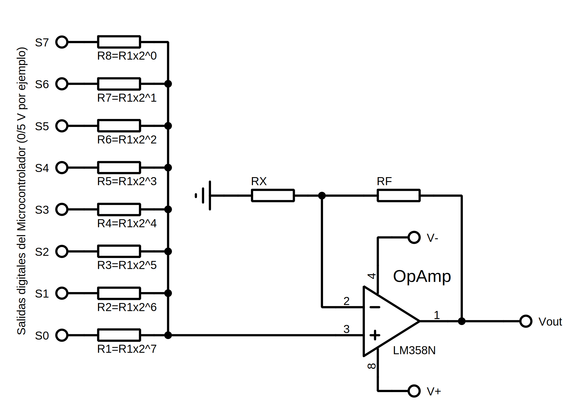
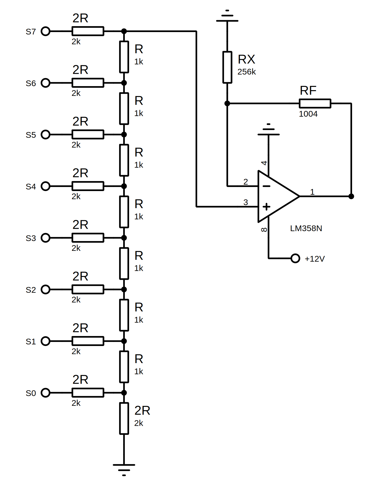
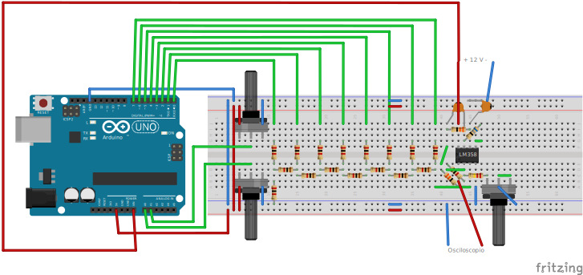
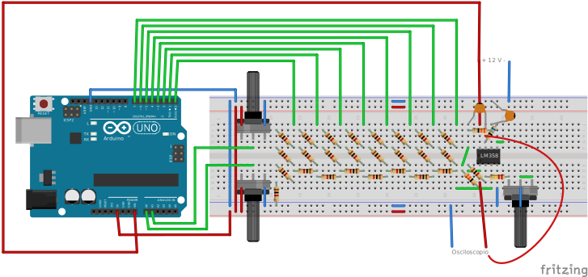

<h1>Convertidores digital-analógico</h1>

En esta sección se explica el funcionamiento de algunos convertidores digital-analógico (DAC por sus siglas en inglés). De esta forma, se creará un generador de funciones por medio de configuraciones con amplificadores operacionales, siendo un paso importante el filtrado para que no se vean escalones.

<h2>Índice</h2>

- [1. DAC con PWM](#1-dac-con-pwm)
- [2. DAC por suma ponderada](#2-dac-por-suma-ponderada)
- [3. DAC R-2R](#3-dac-r-2r)
- [Ejercicio](#ejercicio)

## 1. DAC con PWM
Es el más sencillo de hacer con un Arduino. El PWM de Arduino UNO es de 8 bits y tiene dos frecuencias: 490 Hz para los pines ~3, ~9, ~10 y ~11, y 980 Hz para los pines ~5 y ~6.

Mientras mayor la frecuencia del PWM, mayor la frecuencia de la señal que podemos crear, por lo que esta vez se usará la señal del pin 5 de 980 Hz. 

Simplemente, se selecciona el ancho de pulso deseado correspondiente a la señal entre 0 V y 5 V. Después, se pasa por un filtro pasa-bajas para que se promedie el voltaje, lo que hará que la señal en vez de verse como un montón de picos, se verá como una señal un poco más analógica. 

En la siguiente imagen puede verse la diferencia entre la señal PWM del Arduino (amarilla) y la señal filtrada (azul).

El problema de este método es que debe de haber un equilibrio entre qué tanto se suaviza la señal y la velocidad de carga del condensador, además de que la frecuencia resultante será muchísimo más baja que la ya lenta del PWM, por lo que el resultado será una frecuencia muy baja para mantener la resolución. Es por ello que se recomienda más usar los otros métodos.

En el archivo de Proteus [DAC_PWM.pdsprj](DAC_PWM.pdsprj) se muestra una simulación del PWM del Arduino como DAC, donde en el pin 5 es la salida PWM y en las entradas analógicas A0 y A1 hay potenciómetros para controlar la frecuencia ($1-40$ Hz) de la señal senoidal y la amplitud ($0-5$ V) respectivamente.

El filtro usa varios OpAmps. El primero es un seguidor para poder medir correctamente con el osciloscopio la señal PWM del Arduino y que los condensadores no causen interferencias. Luego podemos usar los selectores para elegir entre dos opciones:
1. La de arriba son filtros pasivos de primer orden en cascada, formando un filtro de segundo orden. Es necesario aislar entre sí cada etapa usando seguidores para facilitar los cálculos.
2. La de abajo es un filtro activo de segundo orden, un pasa-bajas de Butterworth. Los cálculos se hicieron gracias a la página de [Wilaeba Electrónica](https://wilaebaelectronica.blogspot.com/2017/01/filtro-pasa-bajos-activo-de-2do-orden-sallen-key.html) y permite usar un solo OpAmp.

Ambos dan resultados muy similares.

## 2. DAC por suma ponderada
En este caso, se usa un OpAmp en modo de sumador. Básicamente, se considera cada salida digital del Arduino como un bit, por lo que si queremos un ADC de un byte (8 bits), necesitamos 8 pines de salida.

Como resultado, se verá una señal con 255 escalones ($2^8-1$), por lo que la resolución será bastante mejor incluso sin filtrar. 

Si queremos hacer una señal senoidal o triangular, es posible usar un filtro pasa-bajas para hacer la señal aún más limpia. 

Además, como ya no dependemos de la frecuencia del PWM, se pueden usar velocidades de respuesta más altas, aunque sigue dependiendo de la velocidad del microcontrolador y de la cantidad de bits que usemos (a más bits, más tardado); también al ser voltajes ya bastante cercanos a los deseados (a diferencia del PWM, que solo varía entre 0 V y 5 V), el filtro se vuelve más estable.

Ahora, el circuito es sencillo y fácil de calcular, pero el problema del DAC por suma ponderada es que las resistencias son difíciles de conseguir.

La resistencia más pequeña es la que tiene mayor peso (bit más significativo), mientras que la resistencia más grande tiene el menor peso (bit menos significativo). Si consideramos una resistencia inicial $R_1 =1\text{ k}\Omega$ para el bit 7 (en este caso, el bit más significativo), el bit menos significativo (el bit 0) tendrá una resistencia de $R_8 = R_1\times 2^7 = 128\text{ k}\Omega$.

La resistencia $R_F$ se calcula con la ecuación:

$$R_F = R_P\times A$$

Donde $A$ representa la ganancia que se desea obtener y $R_P$ es el paralelo de todas las resistencias de entrada:
$$\frac{1}{\frac{1}{R_1} + \frac{1}{R_1} + \cdot\cdot\cdot + \frac{1}{R_n}}$$

Y el valor de la resistencia $R_X$ está dado por la siguiente ecuación:
R_1, R_2, R_3, R_4,…, R_n
$$R_X = \frac{R_F}{1-A}$$

Donde si el resultado es positivo la resistencia $R_X$ se coloca del pin no inversor a tierra, y si el resultado es negativo la resistencia $R_X$ se coloca del pin inversor a tierra, y si el resultado es indeterminado (infinito) no se debe colocar la resistencia $R_X$. 

El voltaje que usa las salidas del microcontrolador $V_{\text{ref}}$ que en el Arduino UNO es de 5 V y en ESP32 es de 3.3 V, como tal no afecta el diseño del conversor, solo afecta la resolución:

$$\text{Resolución} = \frac{A\times V_{\text{ref}}}{2^n-1}$$

## 3. DAC R-2R

El DAC R-2R también suma los bits de la salida del Arduino y los convierte a una salida analógica, pero en vez de usar muchas resistencias con valores muy distintos, solo utiliza dos valores: $R$ y $2R$. Por eso es una opción mucho más práctica para montarlo físicamente, ya que es más fácil conseguir varias resistencias iguales que una serie completa como en el DAC por suma ponderada.

La red en escalera hace que cada bit aporte la mitad del peso del bit anterior. Así, el bit más significativo es el que más modifica la salida y el bit menos significativo es el que menos influye. Si un bit vale 1, su rama se conecta a $V_{\text{ref}}$; si vale 0, se conecta a tierra.

Una forma de verlo es que el circuito divide sucesivamente el voltaje y la corriente dentro de la escalera, de modo que los pesos quedan en potencias de 2. Gracias a eso, para un convertidor de $n$ bits, la salida cambia en $2^n$ niveles posibles.

Su principal ventaja respecto al DAC por suma ponderada es que conserva la lógica binaria de pesos $\frac{1}{2}$, $\frac{1}{4}$, $\frac{1}{8}$, $\frac{1}{16}$, etc., pero usando solo dos valores de resistencia. Eso reduce errores por tolerancia y hace mucho más sencillo armar el circuito en Protoboard.

La resistencia de realimentación $R_F$ se calcula con la ecuación:

$$R_F = \frac{A \times R}{1 - \frac{1}{2^n}}$$

Donde:

- $A$ es la ganancia deseada.
- $R$ es el valor base de la red R-2R.
- $n$ es el número de bits.

Y el valor de la resistencia $R_X$ está dado por:

$$R_X = \frac{R \times R_F}{R - R_F}$$

Al igual que en el caso anterior, si $R_X$ resulta positiva, se conecta del pin no inversor a tierra; si resulta negativa, se conecta del pin inversor a tierra; y si el resultado es infinito, entonces no se coloca.

El valor de $V_{\text{ref}}$ no cambia la estructura del DAC, solo el rango de voltaje de salida. Si se usa Arduino UNO, normalmente $V_{\text{ref}} = 5\text{ V}$, por lo que el valor máximo ideal de salida será aproximadamente:

$$V_{\text{salida,max}} = A \times V_{\text{ref}}$$

Y la resolución del convertidor será:

$$\text{Resolución} = \frac{A\times V_{\text{ref}}}{2^n-1}$$

En otras palabras, cada vez que el número digital de entrada aumenta en 1, el voltaje de salida aumenta un escalón. Mientras más bits tenga el DAC, más pequeños serán esos escalones y más suave podrá verse la señal, sobre todo si después se usa un filtro pasa-bajas.

## Ejercicio
Se basarán en el [DAC R-2R](#3-dac-r-2r) y el archivo de Proteus [3_DAC_R_2R.pdsprj](3_DAC_R_2R.pdsprj). Si tienen resistencias de 2 k$\Omega$, el circuito en Protoboard es

Y si no consiguen resistencias de 1 k$\Omega$, entonces se usará:

* Van a medir con el osciloscopio la salida del DAC y la salida del filtro.