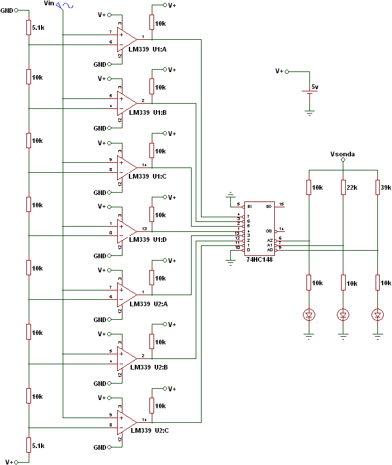
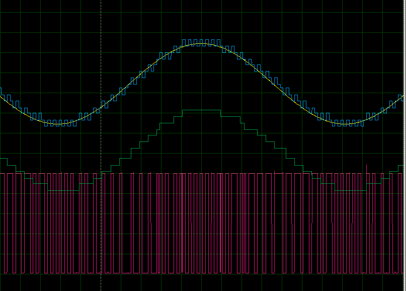
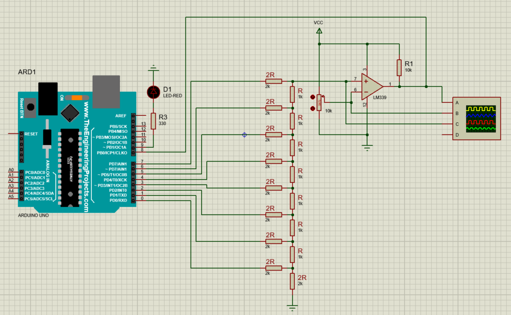

<h1>Convertidores analógico-digital</h1>

En esta sección se explica el funcionamiento de algunos convertidores analógico-digital (ADC por sus siglas en inglés). La idea es ver cómo una señal analógica, por ejemplo el voltaje de un potenciómetro, puede convertirse en un número binario que después puede usarse para visualizar, procesar o controlar otras salidas.

<h2>Índice</h2>

- [1. ADC flash](#1-adc-flash)
- [2. ADC por seguimiento](#2-adc-por-seguimiento)
- [Práctica](#práctica)

## 1. ADC flash

El ADC flash, también llamado ADC paralelo, es uno de los métodos más rápidos para convertir una señal analógica a digital. Su idea principal es muy directa: en vez de comparar el voltaje de entrada una sola vez, se compara al mismo tiempo contra varios niveles de referencia.

La base de este convertidor son varios comparadores analógicos. Cada comparador recibe el mismo voltaje de entrada $V_{\text{in}}$, pero lo compara contra un voltaje diferente generado normalmente con una escalera resistiva. De esta manera, dependiendo del valor de entrada, algunos comparadores cambian de estado y otros no.

Después, esas salidas no se usan directamente como número binario, porque varios comparadores pueden estar activos al mismo tiempo. Por eso normalmente se usa un codificador de prioridad, que convierte ese patrón en una salida digital correcta.

La mayor ventaja del ADC flash es su velocidad, porque la conversión es prácticamente instantánea. La gran desventaja es que requiere muchos comparadores. Para un ADC de $n$ bits se necesitan:

$$2^n - 1$$

comparadores.

Por ejemplo, para 3 bits se necesitan 7 comparadores, para 4 bits se necesitan 15, y para 8 bits se necesitarían 255 comparadores. Por eso esta arquitectura se usa cuando la velocidad es mucho más importante que la simplicidad del circuito.

En resumen, el ADC flash es muy rápido, pero crece demasiado en complejidad al aumentar la resolución. Por eso sirve bien como introducción para entender la comparación de niveles, aunque para montajes didácticos suele ser más práctico estudiar otras arquitecturas.

## 2. ADC por seguimiento

El ADC por seguimiento usa una idea diferente. En vez de tener muchos comparadores trabajando al mismo tiempo, usa un solo comparador y un DAC interno que intenta seguir el valor de la señal de entrada.

En esta práctica, el DAC interno se construye con una red R-2R conectada al puerto D del Arduino. Así, el Arduino genera un voltaje analógico equivalente a un número binario de 8 bits. Ese voltaje se compara contra la señal de entrada usando un comparador como el LM339 o el LM393.

El funcionamiento general es el siguiente:

1. El Arduino coloca un valor digital en el DAC R-2R.
2. El comparador revisa si ese voltaje es mayor o menor que el voltaje de entrada.
3. Si el DAC está por debajo, el valor digital aumenta.
4. Si el DAC está por arriba, el valor digital disminuye.
5. El proceso se repite continuamente, de modo que el DAC sigue a la señal analógica.

Por eso se llama ADC por seguimiento: el valor digital no se reinicia en cada conversión, sino que sube o baja según lo que necesite para acercarse a la entrada.

Esto lo hace más rápido que un ADC por rampa digital, porque no tiene que empezar siempre desde cero. Si la señal cambia poco, el valor digital también cambia poco y el sistema puede seguirla con bastante rapidez.

En el siguiente gráfico puede verse un ejemplo del funcionamiento:

Las señales mostradas son:

- Amarilla: voltaje analógico de entrada.
- Azul: salida del DAC R-2R.
- Rojo: salida del comparador.
- Verde: voltaje estimado o reconstruido a partir del valor digital.

La señal azul no coincide exactamente con la señal de entrada en todo momento, sino que la va alcanzando mediante pequeños escalones. Esa es precisamente la idea del seguimiento: aproximarse continuamente al valor analógico real.

Las conexiones de la práctica son las siguientes:

En este circuito:

- El puerto D del Arduino genera el valor digital de 8 bits para el DAC R-2R.
- El comparador compara la salida del DAC con el voltaje del potenciómetro o del generador de funciones.
- La salida del comparador entra al Arduino para decidir si debe aumentar o disminuir el valor digital.
- Ese mismo valor se usa para cambiar la iluminación de un LED mediante PWM, como una forma sencilla de visualizar el resultado de la conversión.

Puedes ver el [código de Arduino](ADC_seguimiento_R_2R.ino) y el [archivo de Proteus](ADC_seguimiento_R_2R.pdsprj).

Una ventaja importante de este método es que necesita pocos bloques: un comparador, un DAC y la lógica de control. Su desventaja es que no convierte instantáneamente como el ADC flash, porque debe moverse paso a paso hasta acercarse al valor correcto.

## Práctica

1. Completa el circuito en físico basándote en Proteus y verifica su funcionamiento moviendo el potenciómetro para observar cómo cambia la iluminación del LED.
2. Identifica en el circuito qué parte corresponde al DAC, cuál al comparador y cuál a la lógica de seguimiento implementada en el Arduino.
3. Ahora, en vez de un potenciómetro, usa un generador de funciones y conecta el osciloscopio como se muestra en Proteus para comparar la señal de entrada con la señal reconstruida.
4. Explica por qué el ADC flash es más rápido que el ADC por seguimiento, pero también por qué resulta mucho más complejo cuando aumenta el número de bits.