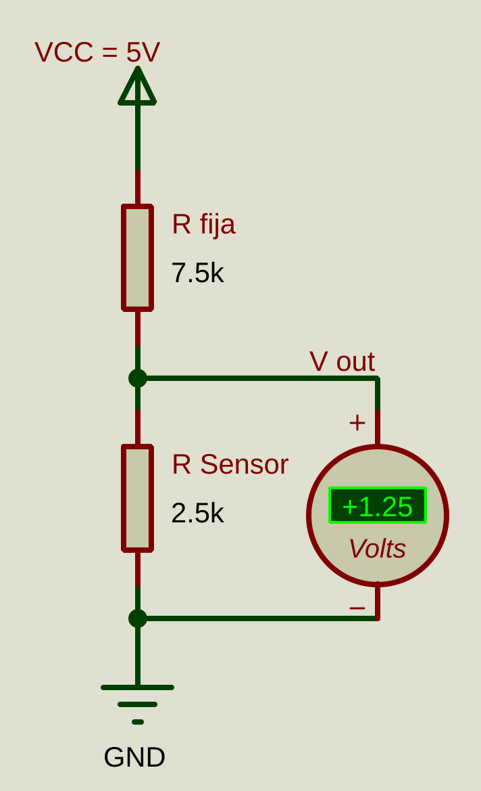
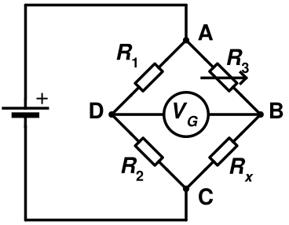

# Introducción a sensores y acondicionamiento básico

En esta sección se introduce la idea general de sensor como bloque que transforma una magnitud física en una señal eléctrica medible. La meta no es estudiar todavía un sensor industrial específico, sino entender dos formas muy comunes de obtener una señal útil con Arduino: el divisor de voltaje y el puente de Wheatstone.

| Anterior | Índice | Siguiente |
|---|---|---|
| [ADC](../7_ADC/ADC.md) | [Volver al índice](../README.md) | [Termistores](../9_Termistores/9_Termistores.md#termistores-ntc-y-ptc) |

<h2>Índice</h2>

- [Introducción a sensores y acondicionamiento básico](#introducción-a-sensores-y-acondicionamiento-básico)
	- [Objetivo](#objetivo)
	- [1. ¿Qué hace un sensor?](#1-qué-hace-un-sensor)
	- [2. Divisor de voltaje](#2-divisor-de-voltaje)
		- [Problemas del divisor de tensión](#problemas-del-divisor-de-tensión)
		- [Práctica base: potenciómetro como sensor en divisor](#práctica-base-potenciómetro-como-sensor-en-divisor)
	- [2. Puente de Wheatstone](#2-puente-de-wheatstone)

## Objetivo

Entender la diferencia entre sensor, transductor, transmisor e instrumento, y comparar dos formas básicas de acondicionamiento para sensores resistivos: el divisor de voltaje y el puente de Wheatstone.

## 1. ¿Qué hace un sensor?

Un sensor convierte una variable física en otra variable que el sistema puede medir. En instrumentación, muchas veces la magnitud física original no llega directamente al Arduino, sino después de una transformación intermedia.

Conviene distinguir cuatro términos que a veces se usan como si fueran sinónimos, aunque no significan exactamente lo mismo:

- Sensor: elemento o dispositivo que detecta una magnitud física de interés.
- Transductor: elemento que transforma una magnitud de una forma a otra. En instrumentación, muchas veces convierte una variable física en una señal eléctrica.
- Transmisor: etapa o dispositivo que toma la señal del sensor o del transductor, la acondiciona y la entrega en una forma utilizable o estandarizada, por ejemplo `0 a 5 V`, `4 a 20 mA`, `I2C` o `SPI`.
- Instrumento: sistema más completo que no solo capta la variable, sino que también puede medirla, filtrarla, visualizarla, registrarla, compararla con una referencia o incluso usarla para una acción de control.

En un sentido estricto, un termistor o una galga extensiométrica funcionan como transductores porque convierten temperatura o deformación en un cambio eléctrico. En cambio, un módulo industrial con salida `4 a 20 mA` suele incluir el elemento sensible más la electrónica de acondicionamiento y transmisión.

En muchos cursos introductorios se usa la palabra sensor para referirse al conjunto completo, aunque internamente ese conjunto puede incluir:

- un elemento transductor, que detecta la magnitud física,
- y una etapa transmisora o de acondicionamiento, que adapta la señal para poder medirla con facilidad.

Por eso, según el contexto, un sensor puede verse como el sistema completo de medición cercano a la magnitud física, mientras que el transductor y el transmisor son partes funcionales dentro de ese sistema.

Cuando se habla de instrumento de medición, normalmente ya se piensa en un conjunto más amplio: puede contener el sensor, el transductor, el acondicionamiento, filtros analógicos o digitales, compensaciones, observadores, una pantalla, memoria de registro y una interfaz de comunicación.

Del mismo modo, un instrumento de control puede integrar todo en una sola unidad: medición, filtrado, comparación con la referencia, decisión de control y salida hacia el actuador. Sin embargo, en la industria también es muy común trabajar de forma modular, separando sensor, transmisor, controlador, indicador y actuador para facilitar calibración, mantenimiento, diagnóstico y reemplazo de equipos.

Ejemplos típicos:

- Temperatura a resistencia variable.
- Presión a deformación mecánica y luego a resistencia.
- Luz a corriente o voltaje.
- Posición a voltaje.

En esta práctica introductoria se usará un potenciómetro para simular un sensor resistivo variable, porque permite observar el principio sin depender todavía de una hoja de datos o de un modelo térmico.

```text
Magnitud física a medir
	Temperatura, presión, luz, posición
		↓
Sensor o transductor
	Termistor, galga extensiométrica, LDR, potenciómetro
		↓
Salida del sensor
	Resistencia variable, voltaje, corriente o dato digital
		↓
Acondicionamiento
	Divisor de voltaje, puente de Wheatstone, amplificación o lectura directa
		↓
Lectura con Arduino o ADC
	analogRead, ADC externo o puerto digital
		↓
Visualización o acción
	LED, monitor serial, LCD o actuador
```

En este caso, nos concentraremos en los sensores resistivos.

## 2. Divisor de voltaje



La opción más simple consiste en colocar el sensor resistivo en serie con una resistencia fija y medir el nodo intermedio.

$$
V_{out}=V_{cc}\frac{R_{sensor}}{R_{fija}+R_{sensor}}
$$

Este método es muy útil cuando:

- la señal no necesita ser diferencial (puedes medirla con respecto a GND),
- el cambio de resistencia es relativamente grande,
- y se busca simplicidad.

En la siguiente imagen, se muestra un ejemplo de uso con diferentes sensores.

[](img/sensores_resistivos.svg)

De izquierda a derecha: 

1. **Potenciómetro**
2. **Termistor con coeficiente de temperatura negativo (NTC)**
3. **Termistor con coeficiente de temperatura positivo (PTC)**
4. **Detector de temperatura por resistencia (RTD)**
5. **Resistencia dependiente de la luz (LDR)**

### Problemas del divisor de tensión

En la imagen, todos los divisores se ajustaron para entregar aproximadamente la mitad de la alimentación, es decir, unos `2.5 V`. Eso permite comparar una idea importante: obtener el mismo voltaje de salida no significa que todos los sensores trabajen en las mismas condiciones eléctricas.

Lo que sí cambia bastante es la corriente que circula por el divisor. Si el sensor y la resistencia fija tienen valores pequeños, la corriente aumenta. Si sus valores son grandes, la corriente disminuye. Por eso dos circuitos que entregan un voltaje parecido pueden exigir corrientes muy distintas.

Ese detalle importa mucho en sensores resistivos pequeños, como algunos `RTD`, porque una corriente alta puede calentarlos por efecto Joule y alterar la medición. Además, cuando el cambio de resistencia del sensor es muy pequeño, el cambio de voltaje en el nodo del divisor también puede ser pequeño y volverse difícil de detectar con buena precisión.

También hay otro problema práctico: si la resistencia del sensor es baja, la resistencia de los cables deja de ser despreciable y puede sumarse a la lectura como si fuera parte del propio sensor.

Por eso el divisor de voltaje es excelente para sensores como potenciómetros, `NTC`, `PTC` o `LDR`, pero en sensores de baja resistencia y cambios pequeños suele preferirse una medición diferencial, por ejemplo con un puente de Wheatstone.

### Práctica base: potenciómetro como sensor en divisor

En el archivo [`8_Divisor_de_voltaje.pdsprj`](8_Divisor_de_voltaje.pdsprj), aparecen varios sensores con divisor de voltaje. Graba un video respondiendo rápidamente las siguientes preguntas.

1. Ahora mismo, su resistencia es casi la misma que la otra resistencia en serie con el sensor, por lo que explica con tus palabras lo que ocurre en el voltaje cuando aumentas o disminuyes el valor del sensor y por qué ocurre.
2. Si se quisieran usan rangos aún más cortos de temperatura, como entre 25 °C y 50 °C para una incubadora y considerando que un Arduino Uno normalmente tiene un rango del ADC entre 0V y 5V, ¿Cuánto se está desperdiciando de ese rango?
3. A mayor potencia disipada por el sensor, mayor calor produce. Se puede obtener multiplicando el voltaje del sensor y la corriente que circula. Se recomiendan valores menores a 0.1 $mW$ o 1 $mW$ dependiendo del sensor. ¿Qué sensores pueden tener problemas y cómo se pueden solucionar?

## 2. Puente de Wheatstone



El puente de Wheatstone usa cuatro resistencias en forma de puente y compara dos divisores al mismo tiempo. Cuando las relaciones de resistencias cumplen una condición de equilibrio, la salida de voltaje diferencial es nula.

La condición ideal de equilibrio es:

$$
\frac{R_2}{R_1}=\frac{R_x}{R_3}=1
$$

Y si usamos $R_1 = R_2$, entonces podemos despejar

$$
R_x = R_3
$$

La selección de $R_1 = R_2$ depende de la potencia máxima que debe disipar el sensor, ya que un valor demasiado grande de potencia puede causar un autocalentamiento que puede falsear la lectura del sensor.

Para seleccionar $R_3$, se usa una resistencia que equivale al valor objetivo a medir como $R_x$; por ejemplo, si queremos hacer una incubadora para que el valor deseado (setpoint) sea de 37.7 °C, vemos la hoja de datos para el valor que tendrá el sensor resistivo en esa temperatura y calibramos $R_3$ con un potenciómetro de precisión (trimmer) en ese valor. Luego, se puede amplificar la salida con un amplificador de instrumentación y compensar el voltaje (offset) para que el valor mínimo del rango de medición del instrumento sea 0 V.

Este método es muy útil cuando:

- el cambio de resistencia es pequeño,
- se busca más sensibilidad alrededor de un punto de equilibrio,
- o se necesita una salida diferencial para amplificarla después.

Por eso aparece con frecuencia en RTD, galgas extensiométricas y sensores piezorresistivos.

| Anterior | Índice | Siguiente |
|---|---|---|
| [ADC](../7_ADC/ADC.md) | [Volver al índice](../README.md) | [Termistores](../9_Termistores/9_Termistores.md#termistores-ntc-y-ptc) |
