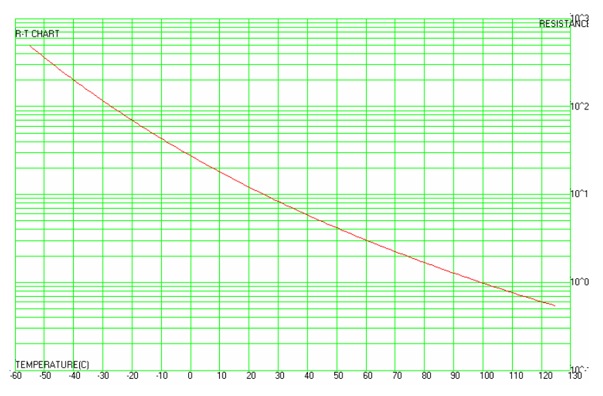
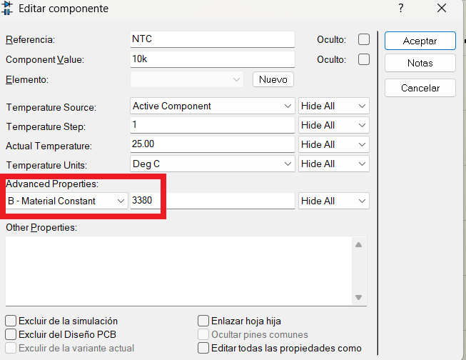
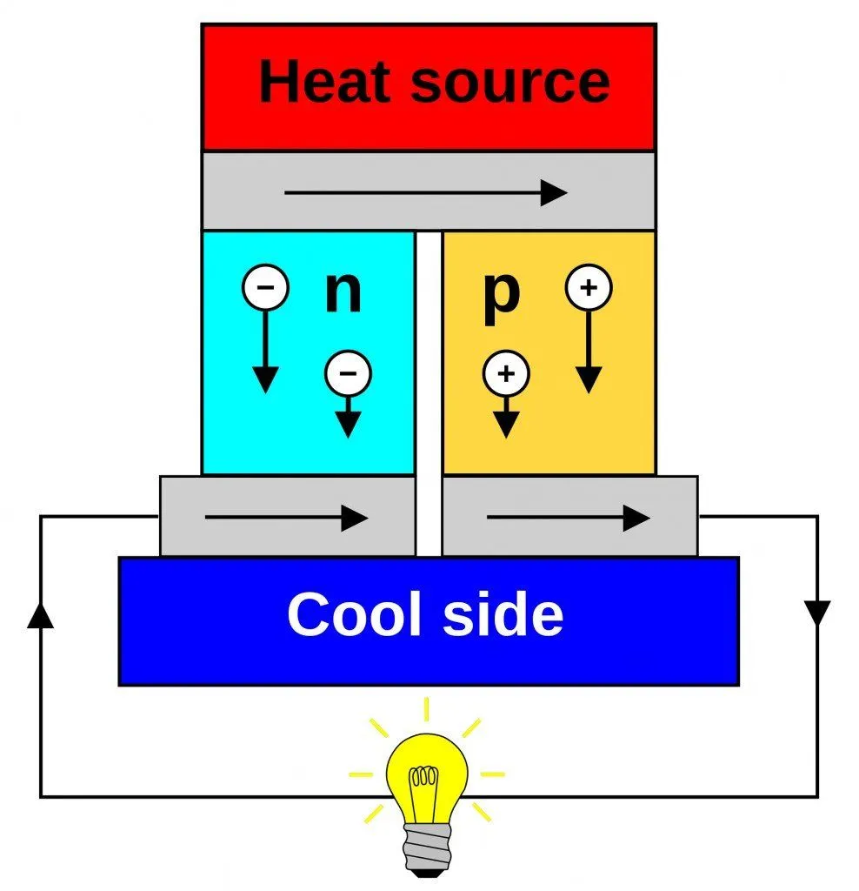
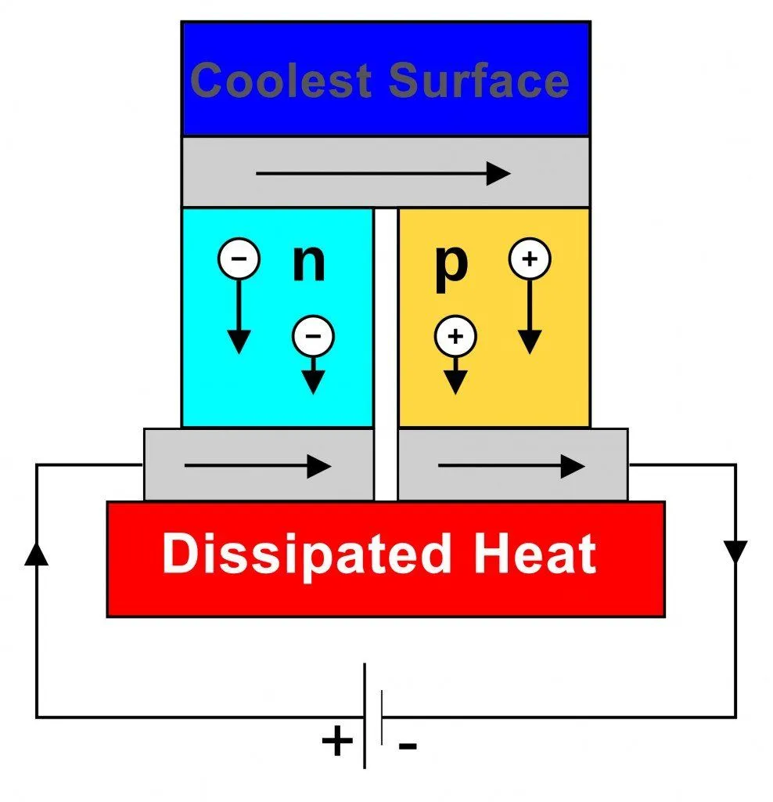
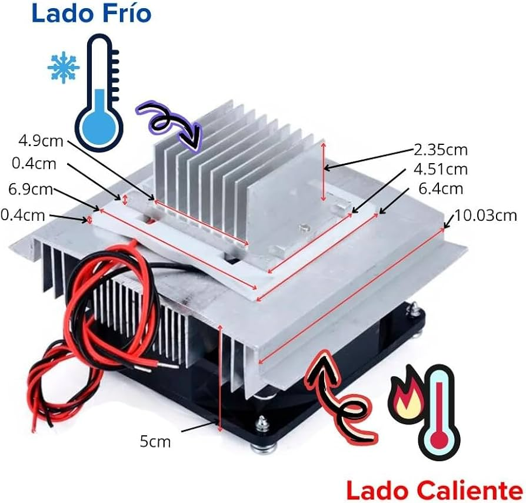

<h1>Medición y control de temperatura</h1>

En esta práctica se estudiarán dos formas comunes de medir temperatura en instrumentación: primero un termistor NTC de `10 kΩ`, y después un termopar. La idea es que el estudiante comience con un sensor sencillo de conectar y modelar, y luego pase a un transductor industrial que exige acondicionamiento analógico, compensación y calibración más cuidadosa.

|Anterior|Índice|Siguiente|
|---|---|---|
|[Teoría de los sensores de temperatura](8_Teoría_Temperatura.md)|[Volver al índice](../README.md)| [Modelado y control didáctico de temperatura](../9_Temperatura_Modelado_Control/9_Temperatura_Modelado_Control.md) |

<h2>Índice</h2>

- [Objetivo](#objetivo)
- [1. Sensores resistivos: PTC y NTC](#1-sensores-resistivos-ptc-y-ntc)
	- [PTC vs NTC](#ptc-vs-ntc)
	- [Modelo aplicado al NTCM-10K-B3380](#modelo-aplicado-al-ntcm-10k-b3380)
		- [Características eléctricas del NTCM-10K-B3380 obtenida de la hoja de datos](#características-eléctricas-del-ntcm-10k-b3380-obtenida-de-la-hoja-de-datos)
		- [Modelo beta](#modelo-beta)
		- [Opción 2: ecuación de Steinhart-Hart](#opción-2-ecuación-de-steinhart-hart)
		- [Criterio práctico de selección](#criterio-práctico-de-selección)
	- [Ventajas y limitaciones del NTC](#ventajas-y-limitaciones-del-ntc)
	- [Divisor de tensión para leer un NTC](#divisor-de-tensión-para-leer-un-ntc)
- [2. Práctica base: medición de temperatura con NTC de 10 kΩ](#2-práctica-base-medición-de-temperatura-con-ntc-de-10-kω)
	- [Conexión sugerida](#conexión-sugerida)
	- [Algoritmo](#algoritmo)
	- [Funciones y cálculos necesarios](#funciones-y-cálculos-necesarios)
	- [Notas de diseño](#notas-de-diseño)
- [3. Termopares](#3-termopares)
	- [¿Qué es un termopar?](#qué-es-un-termopar)
	- [Tipos de termopar más comunes](#tipos-de-termopar-más-comunes)
	- [Enfoque principal: tipo K y tipo J](#enfoque-principal-tipo-k-y-tipo-j)
	- [Temperatura relativa y compensación de unión fría](#temperatura-relativa-y-compensación-de-unión-fría)
	- [Acondicionamiento analógico](#acondicionamiento-analógico)
- [4. Práctica adicional: termopar con compensación usando NTC](#4-práctica-adicional-termopar-con-compensación-usando-ntc)
	- [Arquitectura propuesta](#arquitectura-propuesta)
	- [Algoritmo general](#algoritmo-general)
	- [¿Se necesita puente de Wheatstone?](#se-necesita-puente-de-wheatstone)
- [5. Calibración y sistema dinámico del sensor](#5-calibración-y-sistema-dinámico-del-sensor)
	- [Calibración estática](#calibración-estática)
	- [Modelo dinámico de primer orden](#modelo-dinámico-de-primer-orden)
	- [Prueba sugerida](#prueba-sugerida)
- [6. Actividades propuestas](#6-actividades-propuestas)

## Objetivo

Diseñar un sistema de medición de temperatura escalonado: primero usando un NTC de `10 kΩ` como sensor absoluto de temperatura mediante un divisor de tensión, y después usando un termopar con compensación de unión fría, amplificación y calibración para aplicaciones de mayor temperatura.

## 1. Sensores resistivos: PTC y NTC

Los termistores son resistencias cuyo valor cambia de forma importante con la temperatura. A diferencia de una resistencia común, su variación térmica no se considera un efecto secundario, sino precisamente el principio de medición.

### PTC vs NTC

- Un sensor `PTC` aumenta su resistencia cuando la temperatura aumenta.
- Un sensor `NTC` disminuye su resistencia cuando la temperatura aumenta.

Ambos permiten medir temperatura, pero para prácticas introductorias suele ser más común usar un NTC porque es barato, fácil de conseguir y genera cambios apreciables de voltaje con un circuito muy simple.

Aquí se muestra una tabla de ejemplo con el NTCM-10K-B3380. El eje de la temperatura está en escala $log_{10}$ para verse más lineal.



### Modelo aplicado al NTCM-10K-B3380

Para esta práctica se usará el termistor `NTCM-10K-B3380`. Si vemos su hoja de datos, aparecerá algo parecido a lo siguiente:

#### Características eléctricas del NTCM-10K-B3380 obtenida de la hoja de datos

|     | Item                              | Symbol   | Test conditions                                       | Unit   | Specification   |
|-----|-----------------------------------|----------|-------------------------------------------------------|--------|-----------------|
| 4.1 | Zero Power  Resistance   at 25 ℃ | $R_{25}$      | $Ta=25±0.05$ ℃ Test Power ≤ 0.1mW  Test in fluid liquid | $K\ Ω$    | 10±1%           |
| 4.2 | B-value                           | $B_{25/50}$   | $B=[(T_a×T_b)/(T_b-T_a)]×ln(R_a/R_b)$ $T_b=50$ ℃ ±0.1 ℃          | K      | 3380±1%         |
| 4.3 | Thermal dissipation  Coefficient  | $δ$        | In still air                                          | mW/ ℃  | ≥ 2             |
| 4.4 | Thermal time  constant            | $τ$        | In still air                                          | sec    | ≤ 7             |

De su hoja de datos pueden tomarse directamente dos parámetros muy útiles:

- $R_{25}=10\text{ k}\Omega$
- $B_{25/50}=3380\text{ K}$

Eso permite resolver el sensor de dos maneras, según la precisión requerida y el campo de temperatura de interés.

Las conexiones son las siguientes:


Y se debe configurar en Proteus el parámetro Beta para que la simulación sea precisa:



#### Modelo beta

Es la opción más simple y normalmente la primera que se implementa en Arduino. Se usa cuando el rango de trabajo no es demasiado amplio y cuando se desea una solución directa con pocos parámetros.

La ecuación es:

$$
R(T)=R_0 e^{\beta\left(\frac{1}{T}-\frac{1}{T_0}\right)}
$$

Para este sensor:

- $R_0 = 10,000\ \Omega$
- $T_0 = 25 + 273.15 = 298.15\ K$
- $\beta = 3,380\ K$

Por tanto:

$$
R(T)=10,000\,e^{3380\left(\frac{1}{T}-\frac{1}{298.15}\right)}
$$

Si se desea calcular temperatura a partir de una resistencia medida, conviene usar la forma despejada:

$$
T=\frac{1}{\frac{1}{298.15}+\frac{1}{3,380}\ln\left(\frac{R}{10,000}\right)}
$$

y luego convertir a Celsius:

$$
T_{^\circ C}=T-273.15
$$

Este modelo es apropiado para prácticas introductorias y funciona razonablemente bien en rangos moderados. Sin embargo, su precisión depende del intervalo de medición. Como el dato del fabricante es $B_{25/50}$, la aproximación suele ser más confiable cerca de esa zona que en los extremos del rango total del sensor.

#### Opción 2: ecuación de Steinhart-Hart

Si se requiere más precisión o se pretende trabajar en un rango de temperatura más amplio, conviene usar Steinhart-Hart:

$$
\frac{1}{T}=A+B\ln(R)+C\left[\ln(R)\right]^3
$$

En este caso la hoja de datos no entrega directamente los coeficientes $A$, $B$ y $C$, así que deben obtenerse a partir de tres puntos de la tabla resistencia-temperatura.

Por ejemplo, usando los valores centrales de la tabla:

- a $0\, °C$: $R_1 = 28.743\text{ k}\Omega$
- a $25\, °C$: $R_2 = 10.000\text{ k}\Omega$
- a $50\, °C$: $R_3 = 4.168\text{ k}\Omega$

con sus temperaturas absolutas:

- $T_1 = 273.15\ K$
- $T_2 = 298.15\ K$
- $T_3 = 323.15\ K$

se forma el sistema:

$$
\frac{1}{T_1}=A+B\ln(R_1)+C[\ln(R_1)]^3
$$

$$
\frac{1}{T_2}=A+B\ln(R_2)+C[\ln(R_2)]^3
$$

$$
\frac{1}{T_3}=A+B\ln(R_3)+C[\ln(R_3)]^3
$$

Una vez hallados $A$, $B$ y $C$, se sustituye la resistencia medida y se obtiene la temperatura.

Didácticamente, lo importante es entender esto:

- el modelo beta usa directamente los datos principales del datasheet,
- Steinhart-Hart requiere ajustar coeficientes a partir de la tabla $R$-$T$ o con un bloque de temperatura calibrador,
- y la elección entre uno y otro depende de la precisión exigida y del campo de temperatura que se desee cubrir.

Para una práctica básica alrededor de temperatura ambiente, el modelo beta suele ser suficiente. Si se quiere cubrir un intervalo más amplio o reducir el error de linealización, conviene pasar a Steinhart-Hart o incluso usar directamente la tabla $R$-$T$ del fabricante como referencia.

#### Criterio práctico de selección

En este NTC, una estrategia razonable sería:

1. Usar beta para la primera implementación en Arduino.
2. Comparar los resultados con la tabla del fabricante.
3. Si el error es apreciable en el rango de trabajo, migrar a Steinhart-Hart.
4. Si se busca la mejor exactitud posible en un intervalo concreto, calibrar con puntos reales dentro de ese mismo intervalo.

Esto es importante porque la precisión final no depende solo de la ecuación. También depende de:

- la tolerancia de $R_{25}$,
- la tolerancia del valor beta,
- la resolución del ADC,
- la estabilidad de la resistencia fija del divisor,
- y del campo de temperatura donde se hará la medición.


### Ventajas y limitaciones del NTC

Ventajas:

- Mide temperatura absoluta en el punto donde está colocado.
- Se conecta con un circuito muy simple, normalmente un divisor de tensión.
- Tiene alta sensibilidad en rangos cercanos a temperatura ambiente.
- Es económico y adecuado para laboratorio y control básico.

Limitaciones:

- Su relación resistencia-temperatura es no lineal.
- El rango útil suele ser más reducido que el de un termopar, especialmente si el encapsulado es sencillo.
- Puede presentar autocalentamiento si circula demasiada corriente.
- En temperaturas muy altas deja de ser la mejor opción frente a sensores industriales.

Por eso el NTC es excelente para iniciar y para controlar temperatura moderada, pero no sustituye a un termopar en hornos, cautines o procesos térmicos más severos.

### Divisor de tensión para leer un NTC

La forma más simple de leer un NTC con Arduino es colocarlo en serie con una resistencia fija y medir el nodo intermedio.


Si el divisor se alimenta con $V_{cc}$ y la salida se toma entre la resistencia fija $R_f$ y el NTC $R_{NTC}$, entonces:

$$
V_{out}=V_{cc}\frac{R_{NTC}}{R_f+R_{NTC}}
$$

o, dependiendo de si el NTC se coloca arriba o abajo del divisor, puede obtenerse la forma complementaria. Lo importante es que el voltaje medido cambie con la resistencia del sensor.

Luego, a partir del ADC:

$$
ADC = \frac{V_{out}}{V_{ref}}(2^{10}-1)
$$

se despeja la resistencia del NTC y después se calcula la temperatura mediante Steinhart-Hart.

## 2. Práctica base: medición de temperatura con NTC de 10 kΩ

La primera etapa de la práctica consiste en medir temperatura ambiente o la temperatura de un objeto moderadamente caliente usando un NTC de `10 kΩ` conectado a `A0`.

### Conexión sugerida

- NTC de `10 kΩ` en serie con una resistencia fija de `10 kΩ` para formar el divisor.
- Nodo central del divisor conectado a `A0`.
- Alimentación del divisor con `5 V` y `GND`.
- Salida adicional en `D3`, `D5` o `D6` para una señal PWM que represente el nivel de temperatura.


### Algoritmo

```text
INICIO
	Definir parametros del modelo beta o de Steinhart-Hart
	Definir resistencia fija del divisor
	Definir pin analogico A0
	Definir pin de salida PWM

	setup:
		Iniciar comunicacion serial
		Configurar pin PWM como salida

	loop:
		Leer ADC en A0
		Convertir ADC a voltaje
		Calcular resistencia del NTC
		Aplicar ecuacion beta o Steinhart-Hart
		Convertir kelvin a grados Celsius
		Mapear temperatura a una accion de control
		Escribir salida PWM
		Mostrar temperatura en serial
FIN
```

### Funciones y cálculos necesarios

- `analogRead(A0)`: obtiene la lectura del ADC.
- `log()`: se usa para calcular el logaritmo natural en la ecuación beta y en Steinhart-Hart.
- `pow()`: se usa en el término cúbico de Steinhart-Hart.
- `analogWrite(pin, valorPWM)`: genera una salida proporcional a la temperatura si se desea un control básico.
- `map()` o una ecuación lineal: convierten el rango de temperatura a un rango de control.

Pasos matemáticos típicos:

1. Convertir la lectura ADC a voltaje.
2. Despejar la resistencia del NTC a partir del divisor.
3. Sustituir $R$ en la ecuación beta o en Steinhart-Hart.
4. Convertir a grados Celsius.
5. Escalar la temperatura a una señal útil de visualización o control.

### Notas de diseño

- Conviene que la resistencia fija del divisor sea cercana al valor nominal del NTC en la temperatura de interés; para este caso, `10 kΩ` es una elección razonable.
- Si la corriente por el termistor es muy alta, el sensor puede calentarse por sí mismo y alterar la medición.
- Si se desea mejorar la estabilidad, puede promediarse varias lecturas ADC.
- Si el campo de medición es estrecho y está cerca de `25 ^\circ C`, el modelo beta suele dar resultados suficientemente buenos con menor complejidad.
- Si se busca más precisión o se pretende cubrir un intervalo más amplio, conviene comparar contra la tabla del fabricante y considerar Steinhart-Hart.

## 3. Termopares


### ¿Qué es un termopar?

Un termopar está formado por la unión de dos metales distintos. Cuando existe una diferencia de temperatura entre la unión de medición y la unión de referencia, aparece un voltaje pequeño debido al efecto Seebeck.

[](https://www.scienceabc.com/pure-sciences/what-are-the-seebeck-effect-and-peltier-effect)

Eso significa que el termopar no entrega directamente temperatura absoluta, sino una diferencia de temperatura entre dos uniones. Por eso se le considera un transductor de temperatura relativa.

[](https://www.scienceabc.com/pure-sciences/what-are-the-seebeck-effect-and-peltier-effect)

[](https://www.amazon.com.mx/Disipador-Celda-Peltier-Tec1-12706-Ventilador/dp/B0BFC6ZR72)

### Tipos de termopar más comunes

Existen varios tipos normalizados. Los más conocidos son:

- Tipo `J` (hierro-constantán): buena sensibilidad, uso común en rangos medios, pero se oxida con mayor facilidad.
- Tipo `K` (cromel-alumel): muy popular, amplio rango, robusto y adecuado para laboratorio e industria.
- Tipo `T` (cobre-constantán): útil en bajas temperaturas.
- Tipo `E`: alta sensibilidad.
- Tipo `N`: mejor estabilidad que el tipo K en ciertos entornos.
- Tipos `R`, `S` y `B`: usados en temperaturas muy altas, generalmente en aplicaciones industriales especiales.


### Enfoque principal: tipo K y tipo J

Para esta práctica conviene enfocarse principalmente en los tipos `K` y `J`.

Tipo `K`:

- Es el más usado en instrumentación general.
- Tiene un rango amplio, típicamente desde temperaturas bajo cero hasta más de `1000 ^\circ C`, según encapsulado y montaje.
- Es robusto y fácil de conseguir.

Tipo `J`:

- Tiene buena sensibilidad en rangos medios.
- Es frecuente en equipos antiguos y procesos térmicos moderados.
- Su conductor de hierro lo hace menos conveniente en ambientes muy oxidantes o húmedos.

En un laboratorio docente, el tipo `K` suele ser la mejor primera opción porque tolera mejor temperaturas elevadas, por ejemplo las cercanas a una estación de soldadura.

### Temperatura relativa y compensación de unión fría

Como el termopar mide diferencia de temperatura, hace falta conocer la temperatura en el punto donde los cables del termopar se conectan al circuito de medición. A ese punto se le llama unión fría o unión de referencia.

Si esa unión está a una temperatura $T_{ref}$ y la unión caliente está a $T_{hot}$, el voltaje del termopar representa aproximadamente la diferencia entre ambas. Por eso, para estimar la temperatura real de la punta, se debe medir también $T_{ref}$.

Una manera didáctica de hacerlo es usar un NTC con sonda metálica cerca de la bornera o del bloque terminal donde llegan los cables del termopar. Entonces:

1. El NTC mide la temperatura de la unión fría.
2. El termopar produce una señal proporcional a la diferencia térmica.
3. El sistema suma ambas contribuciones para obtener la temperatura absoluta de la unión caliente.


### Acondicionamiento analógico

La salida de un termopar suele estar en el orden de microvolts por grado Celsius, por lo que no puede conectarse directamente al ADC de Arduino sin acondicionamiento.

Por ello normalmente se requiere:

- Amplificación de alta ganancia.
- Buen rechazo al ruido y al modo común.
- Filtrado pasa-bajas.
- Compensación de unión fría.

Una solución clásica es un amplificador de instrumentación. Este tipo de amplificador permite elevar la pequeña señal diferencial del termopar sin amplificar tanto el ruido común presente en ambos cables.


## 4. Práctica adicional: termopar con compensación usando NTC

La segunda etapa de la práctica consiste en medir la temperatura de una punta caliente usando un termopar, pero midiendo simultáneamente la temperatura de referencia con un NTC de sonda metálica.

### Arquitectura propuesta

- Termopar tipo `K` o tipo `J` en la zona caliente.
- NTC de sonda metálica colocado en la unión fría.
- Amplificador de instrumentación para la señal del termopar.
- Filtro pasa-bajas para estabilizar la salida.
- Arduino para leer el NTC y la señal acondicionada del termopar.

El cálculo general del sistema es:

$$
T_{caliente} \approx T_{fría}+\Delta T_{termopar}
$$

En la práctica real, la relación entre voltaje del termopar y temperatura no es perfectamente lineal en todo el rango, así que lo correcto es usar tablas o polinomios del tipo de termopar seleccionado.


### Algoritmo general

```text
INICIO
	Definir modelo del NTC para union fria
	Definir tipo de termopar usado
	Definir ganancia del amplificador de instrumentacion

	setup:
		Iniciar comunicacion serial
		Configurar entradas analogicas

	loop:
		Leer NTC y calcular temperatura de union fria
		Leer salida amplificada del termopar
		Quitar offset y dividir entre la ganancia total
		Convertir voltaje del termopar a diferencia de temperatura
		Sumar temperatura de union fria
		Mostrar resultado
FIN
```

### ¿Se necesita puente de Wheatstone?

Aquí conviene separar dos ideas:

- Un NTC sí puede colocarse en un puente de Wheatstone cuando se quiere medir cambios pequeños con más sensibilidad o construir un sistema diferencial.
- Un termopar normalmente no se mide con un puente de Wheatstone, porque no se comporta como una resistencia variable sino como una fuente de voltaje diferencial muy pequeña.

Por tanto, en esta práctica el puente de Wheatstone puede explicarse como una alternativa de acondicionamiento para sensores resistivos, pero no como el bloque principal del termopar. Para el termopar, el bloque central es el amplificador de instrumentación junto con la compensación de unión fría.


## 5. Calibración y sistema dinámico del sensor

Esta sección cierra la parte de instrumentación inmediata del sensor. Si se desea pasar del estudio del transductor al estudio de una planta térmica completa, la continuación natural es la práctica [Modelado y control didáctico de temperatura](../9_Temperatura_Modelado_Control/9_Temperatura_Modelado_Control.md), donde se usa una incubadora simple para identificar la dinámica global y comparar estrategias de control.

### Calibración estática

Una forma didáctica de calibrar el sistema es usar una estación de soldadura como fuente térmica controlable y comparar contra la sonda de temperatura de un multímetro.

Procedimiento sugerido:

1. Ajustar la estación de soldadura a varios valores conocidos.
2. Esperar a que el sistema alcance estado estacionario.
3. Registrar la lectura del multímetro, la del NTC y la del termopar.
4. Construir una tabla de calibración o ajustar una recta por tramos si fuera necesario.


### Modelo dinámico de primer orden

Cuando el sensor cambia bruscamente de ambiente térmico, su respuesta no es instantánea. En muchos casos puede aproximarse por un sistema de primer orden:

$$
G(s)=\frac{K}{\tau s + 1}
$$

Donde:

- $K$ es la ganancia estática.
- $\tau$ es la constante de tiempo térmica.

Si se aplica un escalón de temperatura, la respuesta temporal ideal es:

$$
T(t)=T_f-(T_f-T_0)e^{-t/\tau}
$$

El valor de $\tau$ puede estimarse midiendo el tiempo que tarda la respuesta en alcanzar aproximadamente el `63.2 %` del cambio total.

### Prueba sugerida

Para identificar el sistema dinámico:

1. Mantener el sensor a temperatura ambiente.
2. Acercarlo de forma rápida a una superficie caliente o a la punta de la estación de soldadura.
3. Registrar temperatura contra tiempo.
4. Estimar la constante de tiempo y comparar entre el NTC y el termopar.

Esto permite discutir no solo precisión, sino también velocidad de respuesta, que es importante en control de temperatura.


## 6. Actividades propuestas

1. Explica con tus palabras la diferencia entre un `PTC` y un `NTC`.
2. Implementa en Arduino la medición de un NTC de `10 kΩ` usando un divisor de tensión y la ecuación de Steinhart-Hart.
3. Indica cuáles son las ventajas del NTC frente a otros sensores de temperatura y cuáles son sus limitaciones de rango.
4. Investiga las características principales de los termopares tipo `J` y tipo `K` y justifica cuál usarías para una estación de soldadura.
5. Explica por qué el termopar mide temperatura relativa y por qué es necesaria la compensación de unión fría.
6. Diseña en Proteus un bloque de medición para termopar con amplificador de instrumentación y un NTC de referencia en la bornera.
7. Explica en qué caso tendría sentido usar un puente de Wheatstone y por qué no es el bloque principal para leer un termopar.
8. Realiza una calibración experimental usando una estación de soldadura y una sonda de multímetro como referencia.
9. Obtén la respuesta al escalón térmico del sensor y estima su constante de tiempo.

| Anterior | Índice | Siguiente |
|---|---|---|
| [ADC](../7_ADC/ADC.md) | [Volver al índice](../README.md) | [Modelado y control didáctico de temperatura](../9_Temperatura_Modelado_Control/9_Temperatura_Modelado_Control.md) |
