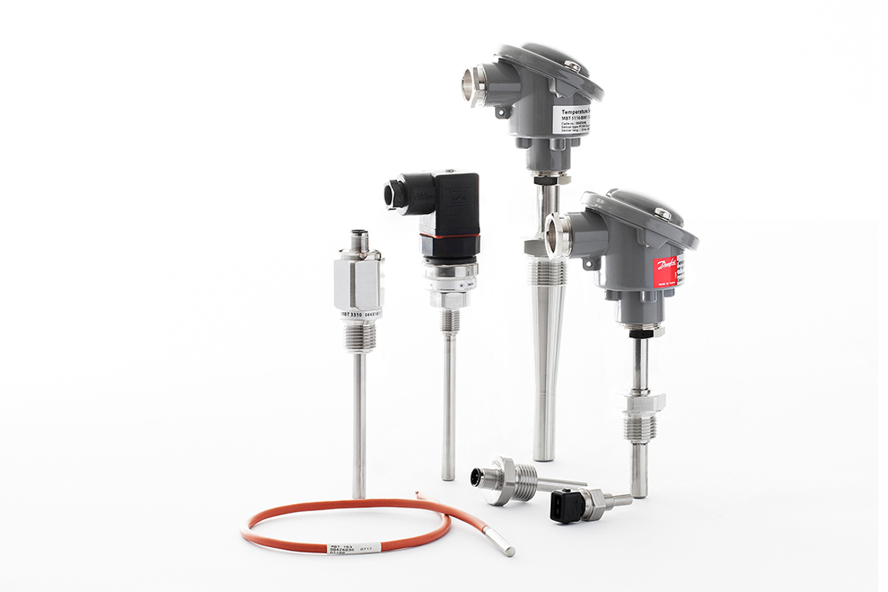
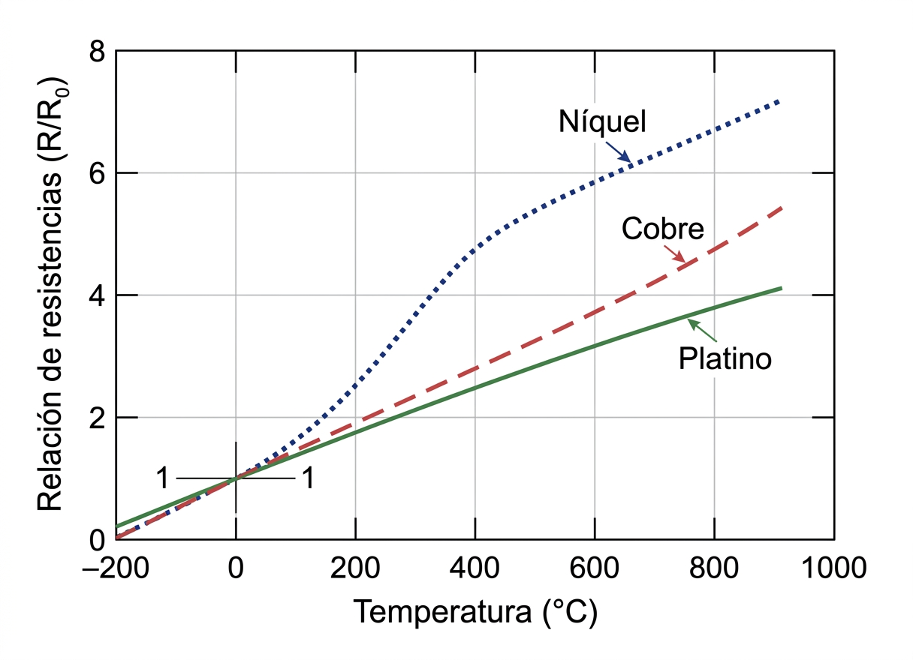
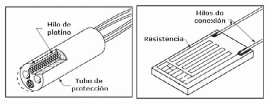
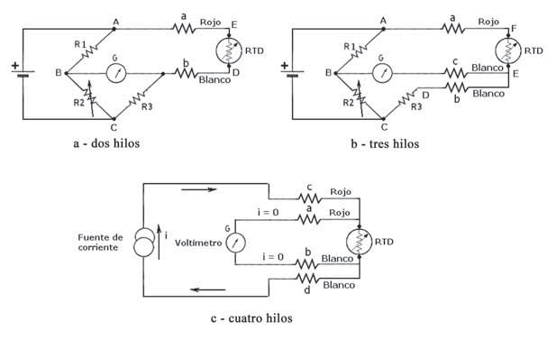

<h1>Teoría de los sensores de temperatura</h1>

Antes de implementar una práctica de temperatura conviene distinguir qué tipo de sensor se está usando, qué variable física cambia internamente y qué tan complejo es su acondicionamiento. No todos los sensores miden la temperatura de la misma forma: algunos cambian su resistencia, otros producen un voltaje, otros integran un circuito semiconductor calibrado y otros incluso miden radiación térmica sin contacto.

Este documento resume las familias más importantes de sensores de temperatura y propone configuraciones recomendadas en Proteus para visualizar cómo se conectan y cómo cambia la electrónica de lectura de un caso a otro.

| Anterior | Índice | Siguiente |
|---|---|---|
| [ADC](../7_ADC/ADC.md) | [Volver al índice](../README.md) | [Prácticas de sensores de temperatura](8_Practicas_Temperatura.md) |

<h2>Índice</h2>

- [Objetivo](#objetivo)
- [1. ¿Qué es medir temperatura?](#1-qué-es-medir-temperatura)
- [2. Clasificación general de sensores de temperatura](#2-clasificación-general-de-sensores-de-temperatura)
  - [Por principio físico](#por-principio-físico)
  - [Por tipo de salida eléctrica](#por-tipo-de-salida-eléctrica)
  - [Panorama industrial clásico](#panorama-industrial-clásico)
- [3. Sensores resistivos](#3-sensores-resistivos)
  - [Termistores NTC y PTC](#termistores-ntc-y-ptc)
  - [No linealidad y modelado matemático](#no-linealidad-y-modelado-matemático)
    - [Modelo beta](#modelo-beta)
    - [Ecuación de Seinhart-Hart](#ecuación-de-seinhart-hart)
  - [RTD: detectores resistivos de temperatura](#rtd-detectores-resistivos-de-temperatura)
  - [Ecuaciones y conexiones de RTD](#ecuaciones-y-conexiones-de-rtd)
- [4. Sensores termoeléctricos: termopares](#4-sensores-termoeléctricos-termopares)
  - [Leyes termoeléctricas básicas](#leyes-termoeléctricas-básicas)
  - [Selección práctica de tipos](#selección-práctica-de-tipos)
  - [Compensación de unión fría](#compensación-de-unión-fría)
  - [Comprobación con tablas ITS-90](#comprobación-con-tablas-its-90)
- [5. Sensores semiconductores analógicos](#5-sensores-semiconductores-analógicos)
  - [LM35](#lm35)
  - [TMP36](#tmp36)
- [6. Sensores digitales integrados](#6-sensores-digitales-integrados)
  - [DS18B20 y sensores digitales de temperatura](#ds18b20-y-sensores-digitales-de-temperatura)
  - [DHT11 y DHT22](#dht11-y-dht22)
- [7. Temperatura interna en otros módulos](#7-temperatura-interna-en-otros-módulos)
  - [Barómetros y sensores ambientales](#barómetros-y-sensores-ambientales)
  - [IMU y sensores MEMS](#imu-y-sensores-mems)
- [8. Sensores de temperatura sin contacto](#8-sensores-de-temperatura-sin-contacto)
- [8. Pirómetros y sensores sin contacto](#8-pirómetros-y-sensores-sin-contacto)
- [9. Tiempos de respuesta orientativos](#9-tiempos-de-respuesta-orientativos)
- [10. Comparación rápida](#10-comparación-rápida)
- [11. ¿Qué conviene enseñar primero?](#11-qué-conviene-enseñar-primero)
- [12. Configuración recomendada en Proteus](#12-configuración-recomendada-en-proteus)
- [13. Actividades sugeridas](#13-actividades-sugeridas)

## Objetivo

Presentar una visión general de los principales sensores de temperatura, clasificándolos por su principio de operación, su tipo de salida eléctrica y su aplicación típica, para que después las prácticas específicas de temperatura tengan un contexto claro.

## 1. ¿Qué es medir temperatura?

Medir temperatura significa asociar el estado térmico de un cuerpo con una variable, usualmente eléctrica que pueda observarse, amplificarse, convertirse o procesarse. Esa variable no siempre es la misma:

- En algunos sensores cambia la resistencia.
- En otros aparece un voltaje proporcional a la temperatura.
- En otros se obtiene un dato digital ya procesado.
- En otros se mide la radiación infrarroja emitida por un objeto.

Por ello, antes de elegir un sensor conviene preguntarse cuatro cosas:

1. ¿Qué rango de temperatura se necesita?
2. ¿Se requiere contacto directo o medición sin contacto?
3. ¿Se busca simplicidad, precisión o robustez industrial?
4. ¿La salida será analógica, diferencial o digital?

## 2. Clasificación general de sensores de temperatura

### Por principio físico

Una clasificación útil es la siguiente:

1. Sensores resistivos.
	Cambian su resistencia con la temperatura. Aquí entran NTC, PTC y RTD.
2. Sensores termoeléctricos.
	Generan un voltaje pequeño por diferencia de temperatura. Aquí entran los termopares.
3. Sensores semiconductores integrados.
	Aprovechan propiedades térmicas del silicio y entregan un voltaje o un dato digital. Aquí entran LM35, TMP36, TMP102, MCP9808, DS18B20, entre otros.
4. Sensores radiativos.
	Miden radiación térmica sin contacto, como termopilas o sensores infrarrojos.

### Por tipo de salida eléctrica

También es útil clasificarlos por la señal que entregan al circuito:

- Salida resistiva: NTC, PTC, RTD.
- Salida analógica de voltaje: LM35, TMP36.
- Salida diferencial de muy baja amplitud: termopares.
- Salida digital: DS18B20, TMP102, DHT11, DHT22, BME280.
- Salida óptica o radiativa procesada: sensores infrarrojos.

Esta segunda clasificación es muy importante en instrumentación porque determina si se necesita divisor de tensión, fuente de corriente, amplificador de instrumentación, ADC directo o protocolo digital.

### Panorama industrial clásico

Antes de la electrónica moderna, ya se medía temperatura en la industria con sensores puramente mecánicos o termo-mecánicos. Siguen siendo importantes porque permiten entender que la temperatura puede transformarse no solo en voltaje o resistencia, sino también en expansión, presión o deformación.

Un termómetro de vidrio usa la dilatación de un líquido dentro de un capilar. Fue durante mucho tiempo la referencia visual más sencilla para laboratorio. Su principal ventaja es la simplicidad, pero hoy queda limitado por fragilidad, lectura local y poca integración con sistemas automáticos.

El termómetro bimetálico aprovecha que dos metales distintos se dilatan de forma diferente. Al unirse en una lámina o espiral, el conjunto se deforma con la temperatura y mueve una aguja. Es muy útil para indicación local robusta, por ejemplo en hornos, tuberías o equipos donde no se necesita una señal eléctrica.

Los termómetros de bulbo y capilar convierten la temperatura en presión o expansión de un fluido encerrado. Fueron muy usados cuando se necesitaba separar físicamente el punto de medición del indicador. Didácticamente son importantes porque muestran una idea clave en instrumentación: transformar una variable en otra más cómoda de transmitir.

| Tecnología clásica | Principio físico | Rango típico orientativo | Uso típico |
|---|---|---|---|
| Vidrio con líquido | Dilatación volumétrica | Muy variable según fluido | Laboratorio y referencia visual |
| Bimetálico | Dilatación diferencial | Aproximadamente 0 a 400 °C en uso continuo | Indicador local industrial |
| Bulbo y capilar | Expansión o presión de fluido | Desde decenas bajo cero hasta varios cientos de °C | Medición remota sin electrónica |

Estos instrumentos no son el centro de las prácticas con Arduino y Proteus, pero sí ayudan a que el alumno vea el panorama completo: no todos los sensores de temperatura nacieron como salidas analógicas o digitales.

## 3. Sensores resistivos

Los sensores resistivos son una excelente introducción porque permiten ver de forma clara cómo una magnitud física se convierte en un cambio de resistencia y después en un cambio de voltaje.

Existe una gran variedad de sondas en el mercado que dependerá de la aplicación.

Y dependiendo del aislante de la sonda, tendrá las siguientes características.

| Material de aislamiento | Intervalo útil de temperaturas | Observaciones |
|---|---|---|
| PVC | $-10$ °C a $105$ °C | Buen aislamiento para entornos ligeros. Muy flexible y a prueba de agua. |
| PTFE (teflón) | $-75$ °C a $250/300$ °C | Resistente a aceites, ácidos y otros. Buena resistencia mecánica y flexibilidad. |
| Fibra de vidrio (barnizada) | $-60$ °C a $350/400$ °C | No es impermeable a los fluidos. No ofrece una buena protección mecánica. |
| Fibra de vidrio (barnizada) de alta temperatura | $-60$ °C a $700$ °C | Soporta temperaturas hasta $700$ °C, pero no es impermeable a los fluidos. Bastante flexible, pero no ofrece buena protección contra agentes físicos. |
| Fibra de cerámica | $0$ °C a $1000$ °C | Soporta altas temperaturas hasta $1000$ °C. No protege contra fluidos o agentes físicos. |
| Fibra de vidrio con acero inoxidable protegido | $-60$ °C a $350/400$ °C | Buena resistencia a los agentes físicos y a la alta temperatura (hasta $400$ °C). No protege contra la entrada de fluidos. |

### Termistores NTC y PTC

Los termistores son resistencias cuya variación térmica es grande y útil para medición. Se fabrican, con óxidos de níquel, manganeso, hierro, cobalto, cobre, magnesio, titanio y otros metales, y están
encapsulados en sondas y en discos.

- Un `NTC` (más común) disminuye su resistencia cuando la temperatura aumenta.
- Un `PTC` (menos común) aumenta su resistencia cuando la temperatura aumenta.

Su mayor ventaja didáctica es que pueden leerse con un divisor de tensión muy simple. Su principal limitación es que no son lineales y su rango útil suele ser más limitado que el de otros sensores.

Aplicaciones típicas:

- Medición de temperatura ambiente.
- Protección térmica.
- Compensación térmica.
- Control de calentadores de baja y media temperatura.

### No linealidad y modelado matemático

La principal limitación de un termistor es que su relación resistencia-temperatura no es lineal. Eso no impide usarlo, pero sí obliga a elegir un modelo matemático adecuado si se quiere convertir resistencia a temperatura con cierta precisión.

En la práctica suelen usarse dos aproximaciones:

1. **Modelo beta**: más simple y muy común en hojas de datos.
2. **Ecuación de Steinhart-Hart**: más general y normalmente más precisa.

#### Modelo beta
El modelo beta suele escribirse como:

$$
R(T)=R_0 e^{\beta\left(\frac{1}{T}-\frac{1}{T_0}\right)}
$$

o, despejando la temperatura:

$$
\frac{1}{T}=\frac{1}{T_0}+\frac{1}{\beta}\ln\left(\frac{R}{R_0}\right)
$$

donde:

- $R$ es la resistencia del termistor a la temperatura $T$.
- $R_0$ es la resistencia de referencia, normalmente a $25\, °C$.
- $T$ y $T_0$ se expresan en kelvin.
- $\beta$ es una constante del material válida de forma aproximada en un intervalo moderado.

En la práctica, esta forma se usa para modelar el comportamiento del NTC; una vez calculado $1/T$, simplemente se invierte el resultado para obtener $T$ en kelvin y luego se convierte a grados Celsius si es necesario.

Cuando la hoja de datos da directamente $R_{25}$ y un valor como $B_{25/50}$ o $B_{25/85}$, lo habitual es empezar con este modelo porque es fácil de implementar y suele ser suficiente en prácticas introductorias o en rangos cercanos a temperatura ambiente.

#### Ecuación de Seinhart-Hart

Una expresión más representativa es la ecuación de Steinhart-Hart:

$$
\frac{1}{T}=A+B\ln(R)+C\left[\ln(R)\right]^3
$$

donde $A$, $B$ y $C$ son coeficientes obtenidos de la hoja de datos o ajustados a partir de una tabla resistencia-temperatura.

La ecuación de Steinhart-Hart describe mejor la curvatura real del NTC en un rango amplio. Por eso suele preferirse cuando:

- se necesita mejor precisión,
- el campo de medición es más amplio,
- o la hoja de datos no solo da un valor beta, sino una tabla completa $R$-$T$.

En cambio, si la aplicación trabaja en un intervalo estrecho, por ejemplo alrededor de temperatura ambiente, el modelo beta suele ser suficientemente bueno y mucho más simple.

En resumen, no siempre hace falta usar el modelo más complejo. La elección depende de la precisión requerida y del campo de temperatura que se quiere cubrir. A mayor exigencia de exactitud o mayor rango de medición, más útil resulta Steinhart-Hart o incluso la tabla $R$-$T$ del fabricante.

Aunque Steinhart-Hart permite modelar mejor un NTC en un rango amplio, en la práctica muchas veces no conviene intentar cubrir un campo demasiado grande con un divisor resistivo simple y un ADC lineal. El problema no es solo matemático, sino también de sensibilidad de medición: la cadena temperatura-resistencia-tensión-código digital no reparte la resolución de forma uniforme. 

En la siguiente figura se aprecia un ejemplo con el NTCM-10K-B3380, donde se puede ver que la mayor resolución se encuentra en el valor de la resistencia del divisor de tensión, que en este caso es la de 10 $k\Omega$ a 25 °C y un ADC de 10 bits de 0 V a 5 V.

Esta es una resolución razonable para una aplicación didáctica, ya que con este sensor no es común medir temperaturas tan altas o bajas con tanta resolución, pero en aplicaciones con mayor resolución en este sensor, suele ser más razonable optimizar la resistencia del divisor usando las tablas de valores y la referencia del ADC para un intervalo de temperatura relevante, o bien cambiar de sensor si se necesita cubrir un rango amplio con calidad más uniforme.

Para realizar la práctica, ve a [práctica del NTC](8_Practicas_Temperatura.md#1-sensores-resistivos-ptc-y-ntc).

### RTD: detectores resistivos de temperatura

Los RTD también cambian su resistencia con la temperatura, pero lo hacen de forma más lineal y estable que muchos termistores. Se fabrican normalmente con platino porque su comportamiento es repetible y preciso.

Ventajas:

- Mayor precisión y estabilidad.
- Mejor linealidad que un NTC.
- Muy usados en instrumentación industrial.

Desventajas:

- Requieren una medición más cuidadosa por su bajo valor resistivo.
- Normalmente, necesitan fuente de corriente o puente de Wheatstone.
- Son más costosos que un NTC simple.

En la industria suelen encontrarse como `Pt100` y `Pt1000`, lo que indica la resistencia nominal del elemento a 0 °C: 100 Ω o 1000 Ω respectivamente. El platino (`Pt`) se usa por su buena estabilidad, su repetibilidad y su linealidad comparativamente alta. Otras curvas de ejemplo se muestran en la siguiente gráfica.

Frente a un NTC, un RTD cambia menos por grado, pero lo hace de forma más predecible. Esa es la razón por la que un NTC suele ser mejor para prácticas introductorias y un RTD suele ser mejor cuando se busca instrumentación más seria o trazable.

Unos ejemplos de la forma de los encapsulados son a) Bobina y b) de película metálica.

Dependiendo del material de la sonda, se tienen las siguientes características

| Elemento | Intervalo útil de temperaturas, °C | Resistencia básica | Sensibilidad  (Ω/°C de 0° a 100 °C) | Coeficiente,  Ω/Ω × °C | Ventajas | Desventajas |
|---|---|---|---|---|---|---|
| Platino | -260 a 850 °C  (-436 a 1562 °F) | 100\ Ω a 0 °C  1000 Ω a 0 °C | 0.39  3.90 | 0,00375 a  0.003927 | Mayor intervalo  mejor estabilidad  buena linealidad | Coste |
| Cobre | -100 a 260 °C  (-148 a 500 °F) | 10 Ω a 25 °C | 0.04 | 0.00427 | Buena linealidad | Baja resistividad |
| Níquel | -100 a 260 °C  (-148 a 500 °F) | 100 Ω a 0 °C  120 Ω a 0 °C | 0.62  0.81 | 0.00618 a  0.00672 | Bajo coste  alta sensibilidad | Falta de linealidad  variaciones del coeficiente de resistencia |
| Níquel-Hierro | -100 a 204 °C  (-148 a 400 °F) | 604 Ω a 0 °C  1000 Ω a 70 °F  1000 Ω a 70 °F | 3.13  4.79  9.58 | 0.00518 a  0.00527 | Bajo coste  muy alta sensibilidad | Relación reducida R100/R0 |

### Ecuaciones y conexiones de RTD

Una aproximación lineal sencilla para una termorresistencia es:

$$
R_t = R_0(1+\alpha t)
$$

donde $R_0$ es la resistencia a $0 °C$, $R_t$ es la resistencia a la temperatura $t$ y $\alpha$ es el coeficiente térmico del material. Esta expresión sirve para entender el principio, pero no describe con precisión todo el rango.

Para un RTD de platino, una forma más realista es la ecuación de Callendar-Van Dusen. En versión simplificada, para temperaturas por encima de $0 °C$, puede escribirse como:

$$
R_t \approx R_0(1 + At + Bt^2)
$$

y para temperaturas negativas aparece un término adicional de tercer orden. No hace falta memorizar los coeficientes en esta etapa; lo importante es entender que el RTD es bastante lineal, pero no perfectamente lineal.

Un problema práctico importante es la resistencia de los cables. Si se mide un `Pt100` con dos hilos largos, la resistencia de los conductores se suma a la del sensor y produce error. Por eso en instrumentación son comunes las conexiones de 3 y 4 hilos, que reducen o compensan ese efecto. En 2 y 3 hilos es frecuente usar un puente de Wheatstone; en 4 hilos suele preferirse una medición Kelvin con corriente conocida y lectura directa de voltaje.

| Conexión | Ventaja | Limitación |
|---|---|---|
| 2 hilos | Muy simple | Error por resistencia de cables |
| 3 hilos | Buena compensación práctica | Requiere cableado más cuidado |
| 4 hilos | Máxima precisión | Más compleja y costosa |

En un puente de Wheatstone se ajustan las resistencias para que, en una condición conocida, el detector vea corriente nula o un voltaje diferencial nulo. Cuando el RTD cambia con la temperatura, el puente se desequilibra y aparece una pequeña señal que luego puede amplificarse.

En **conexión de 2 hilos**, el brazo del sensor incluye la resistencia del RTD y la de ambos conductores. En equilibrio:

$$
\frac{R_1}{R_3}=\frac{R_2}{RTD + K(a+b)}
$$

donde $K$ es la resistencia por unidad de longitud y $a$, $b$ son las longitudes de los cables. Si no se quiere entrar al detalle geométrico del cable, la misma idea puede escribirse como:

$$
R_{medida}=R_{RTD}+2R_L
$$

Por eso el montaje de 2 hilos es simple, pero introduce error apreciable cuando el sensor es de bajo valor, por ejemplo un `Pt100`.

En **conexión de 3 hilos**, se puede compensar la resistencia de línea colocándola en ramas adyacentes del puente:

$$
\frac{R_1}{R_3+Kb}=\frac{R_2}{RTD+Ka}
$$

Si los cables son equivalentes, es decir $Ka=Kb$, y además se ajusta la relación del puente para que $R_2/R_1=1$, resulta aproximadamente:

$$
RTD \approx R_3
$$

Ese es el motivo por el que el montaje de 3 hilos es tan común en industria: no elimina todo error, pero compensa bien si los conductores tienen resistencias muy parecidas.

Cuando el puente se separa un poco del equilibrio, aparece un pequeño voltaje diferencial. Si esa salida entra a un amplificador de instrumentación, entonces:

$$
V_{out}=G\,V_{bridge}+V_{ref}
$$

El amplificador de instrumentación no calcula la temperatura; solo amplifica el desequilibrio del puente con buen rechazo al modo común para que el ADC o el instrumento puedan leerlo.

En conexión de 4 hilos, la medición suele plantearse de forma más directa. Se fuerza una corriente conocida por el RTD y se mide el voltaje exactamente sobre el elemento:

$$
R_{RTD}=\frac{V_{RTD}}{I}
$$

Después, esa resistencia se convierte a temperatura usando la ecuación del RTD o una tabla. La ventaja es que los cables de sensado prácticamente no conducen corriente, por lo que su caída de voltaje resulta despreciable y se obtiene la mayor exactitud.

En resumen:

- 2 hilos: simple, pero con error por cables.
- 3 hilos: muy usado en industria porque compensa bien si los conductores son equivalentes.
- 4 hilos: el más preciso, normalmente con medición Kelvin por corriente y voltaje.
- Puente de Wheatstone: convierte cambios pequeños de resistencia en una señal diferencial pequeña.
- Amplificador de instrumentación: amplifica la salida del puente para hacerla utilizable por el ADC.

## 4. Sensores termoeléctricos: termopares

Un termopar se forma con la unión de dos metales diferentes. Si existe una diferencia de temperatura entre la unión de medición y la unión de referencia, aparece un voltaje pequeño debido al efecto Seebeck.

Eso implica dos cosas importantes:

1. El termopar no mide temperatura absoluta directamente.
2. La señal disponible es muy pequeña y exige acondicionamiento analógico.

Los tipos más usados son `K`, `J`, `T`, `E`, `N`, `R`, `S` y `B`, cada uno con materiales y rangos distintos. En laboratorio suele ser muy conveniente empezar con el tipo `K`, y comparar después con el tipo `J`.

Ventajas:

- Muy amplio rango de temperatura.
- Buena robustez para aplicaciones industriales.
- Adecuados para hornos, cautines y procesos térmicos severos.

Desventajas:

- Señal muy pequeña.
- Necesitan compensación de unión fría.
- La conversión voltaje-temperatura no es perfectamente lineal.

### Leyes termoeléctricas básicas

El capítulo de Creus resume tres leyes muy útiles para entender por qué un termopar se puede medir correctamente y por qué la unión fría importa:

1. Ley del circuito homogéneo.
  Un solo metal homogéneo no genera por sí mismo una f.e.m. termoeléctrica útil solo por calentarlo.
2. Ley de los metales intermedios.
  Es posible insertar metales intermedios en el circuito sin alterar la medición, siempre que las uniones añadidas estén a la misma temperatura.
3. Ley de las temperaturas sucesivas.
  La f.e.m. entre $T_1$ y $T_3$ puede obtenerse sumando algebraicamente la f.e.m. entre $T_1$ y $T_2$ y la f.e.m. entre $T_2$ y $T_3$.

Estas leyes son la base conceptual de la compensación de unión fría y del uso de tablas de conversión.

Además del efecto Seebeck, en la teoría termoeléctrica aparecen también los efectos Peltier y Thomson. Para este curso basta saber que ayudan a explicar el origen físico completo de la f.e.m. y que justifican por qué la corriente de medida en un termopar debe mantenerse muy pequeña.

### Selección práctica de tipos

No todos los termopares sirven para lo mismo. La elección depende del rango, de la atmósfera y de la sensibilidad.

| Tipo | Materiales principales | Rango orientativo | Sensibilidad típica | Uso recomendado |
|---|---|---|---|---|
| E | Cromel / Constantán | -200 a 900 °C | Alta, alrededor de 68 μV/°C | Cuando interesa mayor sensibilidad |
| T | Cobre / Constantán | -200 a 260 °C | Media | Bajas temperaturas y humedad |
| J | Hierro / Constantán | -200 a 750 °C de uso práctico robusto | Media | Procesos medios; evitar oxidación alta |
| K | Cromel / Alumel | -40 a 1100 °C de uso común | Media, alrededor de 41 μV/°C | Opción general de laboratorio e industria |
| R / S | Platino-Rodio / Platino | Hasta 1500 °C | Baja, cerca de 10 μV/°C | Alta temperatura con buena estabilidad |
| B | Platino-Rodio | Hasta 1800 °C | Baja | Temperaturas muy elevadas |
| N | Aleaciones de níquel con cromo y silicio | Muy amplio, según construcción | Similar a K | Sustituto moderno del tipo K en ambientes severos |

En práctica docente, el tipo `K` suele ser el más equilibrado porque combina disponibilidad, robustez y rango amplio. El tipo `J` es útil para comparar comportamiento y discutir limitaciones por oxidación del hierro. El tipo `E` también es interesante si se quiere mostrar que no todos los termopares tienen la misma sensibilidad.

### Compensación de unión fría

Las tablas de f.e.m. de termopares suelen estar referidas a una unión de referencia a `0 ^\circ C`. Pero en un montaje real la bornera o el punto donde llegan los cables rara vez está a esa temperatura. Por eso se necesita compensación de unión fría.

La idea básica es esta:

$$
E(T_{caliente},0) = E(T_{caliente},T_{fría}) + E(T_{fría},0)
$$

En otras palabras, el termopar entrega la diferencia entre la unión caliente y la fría, y el sistema debe reconstruir la referencia a `0 ^\circ C` usando la temperatura medida en la unión fría.

Didácticamente, el flujo recomendable es:

1. Medir la unión fría con un NTC o sensor equivalente.
2. Convertir esa temperatura a una f.e.m. equivalente del mismo tipo de termopar.
3. Sumar esa f.e.m. a la f.e.m. medida del termopar.
4. Usar la tabla o curva correspondiente para obtener la temperatura de la unión caliente.

### Comprobación con tablas ITS-90

En un curso introductorio no hace falta empezar por polinomios largos de conversión. Es más didáctico trabajar primero con tablas ITS-90 o con curvas simplificadas. Eso permite comprobar tres ideas importantes:

1. Que la relación f.e.m.-temperatura no es perfectamente lineal.
2. Que dos termopares distintos no entregan la misma f.e.m. a la misma temperatura.
3. Que la compensación de unión fría modifica el resultado final.

Un buen ejercicio de comprobación es tomar un termopar tipo `K` o `J`, consultar en tabla la f.e.m. para dos temperaturas cercanas y estimar su sensibilidad local en ese intervalo:

$$
S \approx \frac{\Delta E}{\Delta T}
$$

Después puede repetirse la comparación con otro tipo, por ejemplo `E`, para verificar por qué algunos termopares son preferibles cuando se desea una señal mayor por grado.

Configuración recomendada en Proteus:

- Termopar representado como fuente diferencial de baja amplitud.
- Amplificador de instrumentación.
- Filtro pasa-bajas.
- NTC o sensor equivalente en la bornera para compensación de unión fría.

## 5. Sensores semiconductores analógicos

Los sensores semiconductores integrados usan propiedades del silicio para producir una señal eléctrica relacionada con la temperatura. A diferencia del NTC, el usuario no ve el elemento físico interno, sino una salida ya acondicionada.

### LM35

El `LM35` entrega un voltaje analógico proporcional a la temperatura en grados Celsius. Su gran ventaja didáctica es que la relación es casi lineal y muy fácil de interpretar.

Idea básica:

$$
V_{out} \propto T
$$

En muchos contextos introductorios se resume como aproximadamente `10 mV/°C`.

Ventajas:

- Muy fácil de usar.
- Salida lineal.
- No requiere linealización compleja.

Desventajas:

- Menor rango que un termopar.
- Sigue siendo un sensor de contacto.
- Puede requerir cuidado con referencia ADC y ruido.

Configuración recomendada en Proteus:

- LM35 alimentado con `5 V`.
- Salida directa al ADC.
- Visualización de temperatura en monitor serial o LCD.

### TMP36

El `TMP36` es parecido al LM35, pero incluye un offset que le permite medir también temperaturas bajo cero con más facilidad dentro de ciertos rangos de alimentación.

Didácticamente es útil para mostrar que no todos los sensores analógicos parten de `0 V` cuando la temperatura es `0 ^\circ C`.

Configuración recomendada en Proteus:

- TMP36 alimentado con `5 V`.
- Salida analógica al ADC.
- Ecuación en software para remover el offset.

## 6. Sensores digitales integrados

Los sensores digitales entregan la temperatura ya convertida a un dato digital. Eso simplifica el hardware externo, pero vuelve menos visible el acondicionamiento interno del sensor.

### DS18B20 y sensores digitales de temperatura

El `DS18B20` es un sensor muy popular porque permite medir temperatura con una interfaz digital de un solo hilo de datos. Internamente realiza el acondicionamiento y la conversión, de modo que el microcontrolador recibe ya un valor procesado.

Ventajas:

- Buena simplicidad de cableado.
- La señal es menos sensible al ruido analógico directo.
- Es útil para introducir protocolos digitales en sensores.

Desventajas:

- El alumno deja de ver el proceso de conversión analógica.
- Requiere comprender un protocolo digital.

Configuración recomendada en Proteus:

- Sensor digital conectado a un pin del microcontrolador.
- Resistencia pull-up en la línea de datos cuando aplique.
- Visualización de la lectura en serial o LCD.

### DHT11 y DHT22

Los sensores `DHT11` y `DHT22` son módulos integrados que suelen combinar medición de temperatura y humedad. Se usan mucho en proyectos introductorios porque su conexión es simple y la lectura final es digital.

Sin embargo, didácticamente conviene presentarlos como módulos listos para usar y no como ejemplo del principio físico puro, porque gran parte del trabajo interno ya ocurre dentro del encapsulado.

Configuración recomendada en Proteus:

- Módulo DHT conectado al microcontrolador.
- Línea de datos digital.
- Visualización combinada de temperatura y humedad.

## 7. Temperatura interna en otros módulos

Muchos módulos no están diseñados principalmente como termómetros, pero incluyen un sensor de temperatura interno. Ese valor suele servir para compensación o corrección del propio dispositivo.

### Barómetros y sensores ambientales

Módulos como `BMP280` o `BME280` miden presión, y en algunos casos también humedad, pero internamente incluyen un sensor térmico. Esa temperatura se usa para compensar la respuesta del elemento sensor principal.

Por eso la “temperatura” que reportan puede aproximarse a la ambiental, pero en realidad está muy influida por la temperatura del encapsulado y de la tarjeta donde está montado el módulo.

Configuración recomendada en Proteus:

- Bloque etiquetado como sensor ambiental digital.
- Interfaz digital hacia el microcontrolador.
- Nota visible indicando que la temperatura interna sirve principalmente para compensación.

### IMU y sensores MEMS

Las IMU y otros sensores MEMS también suelen incluir medición interna de temperatura. En este caso, el objetivo principal no suele ser medir el ambiente con precisión, sino corregir la deriva térmica del acelerómetro o del giroscopio.

Eso es importante didácticamente porque enseña que no todo “sensor de temperatura” se usa como termómetro de proceso. A veces solo se usa para mejorar otra medición.

Configuración recomendada en Proteus:

- Bloque IMU con interfaz digital.
- Nota explicativa sobre compensación térmica interna.

## 8. Sensores de temperatura sin contacto

## 8. Pirómetros y sensores sin contacto

Los pirómetros y sensores infrarrojos estiman la temperatura a partir de la radiación térmica emitida por el cuerpo. En vez de tocar la superficie, miden energía radiante y la relacionan con la temperatura del objeto.

Esto los vuelve especialmente útiles cuando el objeto está en movimiento, es inaccesible, está energizado o se encuentra a temperaturas demasiado altas para contacto directo.

Ventajas:

- No requieren contacto físico.
- Son útiles cuando el objeto está muy caliente, en movimiento o es inaccesible.

Desventajas:

- La medida depende de la emisividad del material.
- La medición depende de la emisividad y de la geometría.
- Son más sensibles a condiciones del entorno.
- Su principio es menos simple para una primera práctica.

La emisividad es importante porque dos superficies a la misma temperatura no necesariamente emiten la misma radiación. Por eso un pirómetro mal ajustado puede dar errores apreciables si cambia el material, el acabado superficial o el ángulo de observación.

En la práctica, esta familia complementa a los sensores de contacto en vez de sustituirlos por completo. Si se necesita medir la punta de un termopar o una superficie fija, un sensor de contacto puede ser mejor. Si se necesita medir una banda transportadora, un objeto girando o una superficie muy caliente, el pirómetro suele ser más adecuado.

Configuración recomendada en Proteus:

- Bloque de sensor infrarrojo o termopila como módulo digital.
- Visualización de lectura y nota sobre emisividad.

## 9. Tiempos de respuesta orientativos

Además del rango y la precisión, en instrumentación importa cuánto tarda el sensor en responder a un cambio térmico.

| Sensor | Tiempo de respuesta orientativo | Comentario |
|---|---|---|
| NTC pequeño | Bajo | Muy sensible y rápido en aire o contacto ligero |
| RTD industrial con vaina | Medio | Más estable, pero la vaina puede volverlo más lento |
| Termopar fino | Muy bajo | Muy útil cuando importa capturar cambios rápidos |
| LM35/TMP36 | Medio | Depende mucho del encapsulado y del montaje |
| DS18B20 | Medio a alto | Además del sensor, influye el tiempo de conversión digital |
| Pirómetro | Muy bajo | No hay inercia por contacto directo |

Por eso no siempre el sensor más preciso es el mejor. Si el proceso cambia rápido, un termopar fino o un sensor óptico puede ser preferible a una sonda robusta pero lenta.

## 10. Comparación rápida

| Familia | Principio | Rango típico | Linealidad | Acondicionamiento | Uso típico |
|---|---|---|---|---|---|
| NTC/PTC | Resistencia variable | Bajo a medio | Baja | Divisor o puente | Control básico y compensación |
| RTD | Resistencia metálica | Medio a alto | Buena | Fuente de corriente o puente | Instrumentación industrial |
| Termopar | f.e.m. Seebeck | Muy alto | Media a baja | Amplificación y unión fría | Hornos, cautines, procesos rápidos |
| LM35/TMP36 | Semiconductor analógico | Bajo a medio | Buena | ADC directo | Laboratorio y enseñanza |
| DS18B20 | Semiconductor digital | Bajo a medio | Buena para el usuario | Protocolo digital | Sistemas sencillos con cableado digital |
| DHT11/DHT22 | Módulo integrado | Bajo a medio | Suficiente en uso hobby | Protocolo digital | Proyectos introductorios |
| BMP/BME/IMU | Sensor interno de chip | Variable | Secundaria | Interfaz digital | Compensación y monitoreo interno |
| Pirómetro | Radiación térmica | Medio a muy alto | Depende de emisividad | Óptico o digital | Objetos calientes o inaccesibles |

## 11. ¿Qué conviene enseñar primero?

Una secuencia didáctica recomendable es esta:

1. NTC en divisor de tensión.
2. LM35 o TMP36 como sensor analógico lineal.
3. RTD como ejemplo de medición resistiva más precisa.
4. Termopar con amplificador de instrumentación y compensación.
5. Sensores digitales como módulos listos para usar.
6. Sensores internos de módulos y sensores sin contacto como panorama general.

Esta secuencia va de lo más visible y sencillo a lo más industrial o abstracto.

## 12. Configuración recomendada en Proteus

Si se quiere construir un archivo comparativo en Proteus, conviene organizarlo por bloques didácticos en lugar de intentar hacer una sola simulación continua con todos los sensores mezclados.

Distribución sugerida:

1. Bloque de sensores resistivos: NTC, PTC y RTD.
2. Bloque de sensores analógicos integrados: LM35 y TMP36.
3. Bloque de sensores diferenciales: termopar con amplificador de instrumentación.
4. Bloque de módulos digitales: DS18B20, DHT11/DHT22 y módulo ambiental.
5. Bloque de sensores internos de compensación: barómetro o IMU.
6. Bloque de visualización central con Arduino, LCD, terminal virtual o LEDs.

Buenas prácticas para el diagrama:

- Colocar cada familia dentro de un rectángulo con nombre.
- Usar pines o terminales con nombre para no saturar de cables largos.
- Añadir una nota debajo de cada bloque indicando el tipo de salida: resistiva, analógica, diferencial o digital.
- Marcar cada captura de Proteus como configuración recomendada, no necesariamente como diseño final industrial.

## 13. Actividades sugeridas

1. Clasifica cada sensor estudiado según su principio físico.
2. Indica cuáles entregan una resistencia, cuáles un voltaje y cuáles un dato digital.
3. Explica por qué un termopar requiere más acondicionamiento que un LM35.
4. Compara el uso de un NTC frente a un RTD para una medición de laboratorio y comenta cuál ofrece mejor linealidad.
5. Explica por qué una conexión RTD de 2 hilos introduce más error que una de 3 o 4 hilos.
6. Selecciona un termopar adecuado para una estación de soldadura y justifica por ambiente, rango y sensibilidad.
7. Usando una tabla ITS-90 recortada de un termopar tipo `K` o `J`, estima la sensibilidad local en un intervalo pequeño y compárala con la de otro tipo.
8. Explica por qué la unión fría debe medirse y cómo se aplica la ley de temperaturas sucesivas en esa corrección.
9. Explica por qué la temperatura interna de un barómetro o de una IMU no siempre coincide exactamente con la temperatura ambiente.
10. Justifica en qué casos conviene usar un sensor digital y en cuáles es mejor estudiar primero uno analógico.
11. Indica en qué situaciones un pirómetro sería mejor que un sensor de contacto.
12. Elabora en Proteus un esquema por bloques donde aparezcan las configuraciones recomendadas de al menos cuatro familias de sensores.