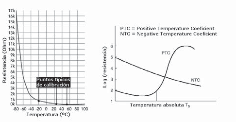
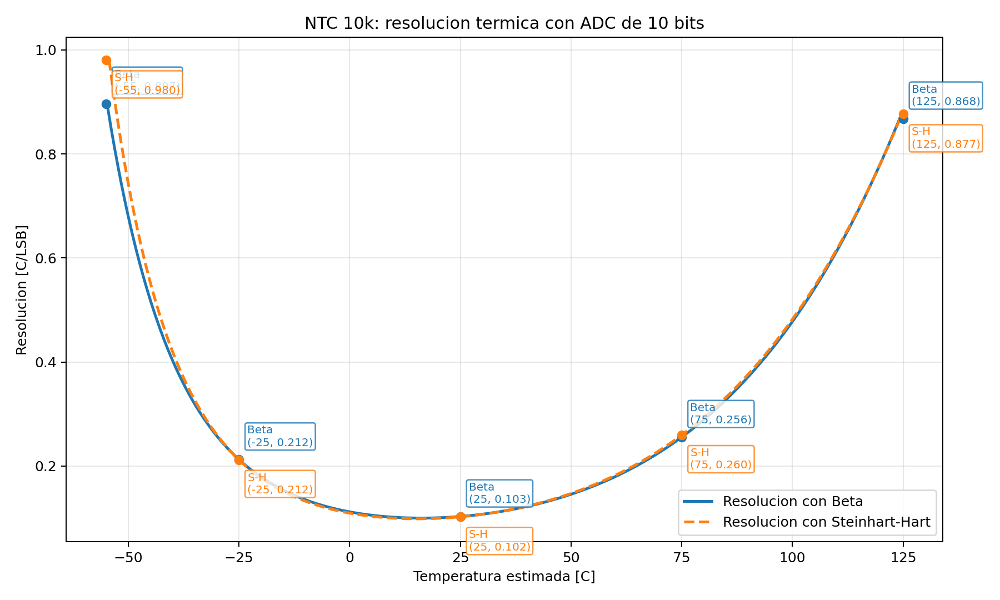
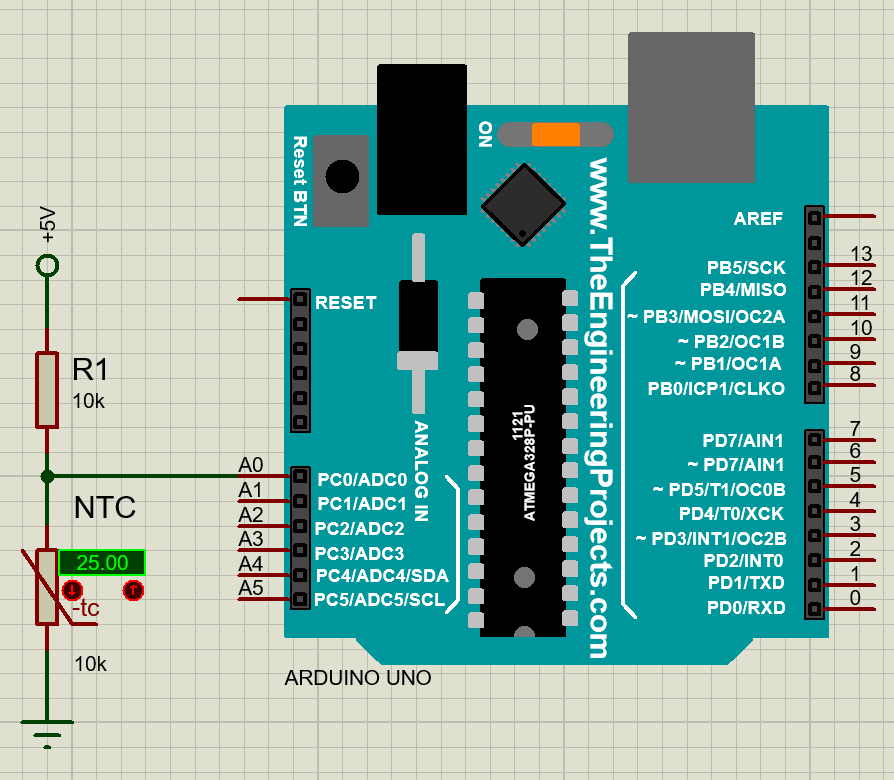
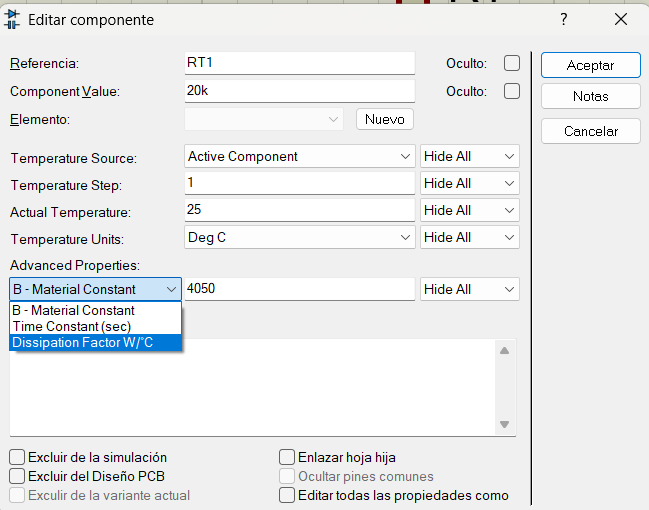

<h1>Termistores NTC y PTC</h1>

En esta sección se estudian los termistores como sensores resistivos dependientes de la temperatura. La idea es pasar de un sensor resistivo genérico a dos casos útiles: una práctica base con el NTC por defecto de Proteus y una referencia más específica con un NTC real orientado a un punto de trabajo cercano a `37.7 °C`.

| Anterior | Índice | Siguiente |
|---|---|---|
| [Introducción a sensores](../8_Sensores/8_Sensores.md) | [Volver al índice](../README.md) | [Sensores semiconductores](../10_Semiconductores/10_Semiconductores.md) |

<h2>Índice</h2>

- [1. Termistores](#1-termistores)
- [2. NTC y PTC](#2-ntc-y-ptc)
	- [No linealidad y modelado matemático](#no-linealidad-y-modelado-matemático)
		- [Modelo beta](#modelo-beta)
		- [Ecuación de Seinhart-Hart](#ecuación-de-seinhart-hart)
	- [Importancia del rango de medición](#importancia-del-rango-de-medición)
- [3. Lectura con divisor de voltaje](#3-lectura-con-divisor-de-voltaje)
- [4. Práctica base: NTC por defecto de Proteus](#4-práctica-base-ntc-por-defecto-de-proteus)
	- [Archivo de la práctica base](#archivo-de-la-práctica-base)
	- [Conexión sugerida](#conexión-sugerida)
	- [Algoritmo](#algoritmo)
	- [Funciones necesarias](#funciones-necesarias)
- [5. Caso específico: autocalentamiento cerca de 37.7 °C](#5-caso-específico-autocalentamiento-cerca-de-377-c)
	- [Práctica adicional: medición con excitación por pulsos](#práctica-adicional-medición-con-excitación-por-pulsos)
	- [Conexión sugerida](#conexión-sugerida-1)
	- [Secuencia de medición](#secuencia-de-medición)
	- [Código de ejemplo](#código-de-ejemplo)
	- [Práctica](#práctica)

## 1. Termistores

Existe una gran variedad de sondas en el mercado que dependerá de la aplicación.

[](https://www.ntcsensors.com/Sondas_y_componentes_del_sensor_NTC/)

Y dependiendo del aislante de la sonda, tendrá las siguientes características.

| Material de aislamiento | Intervalo útil de temperaturas | Observaciones |
|---|---|---|
| PVC | $-10$ °C a $105$ °C | Buen aislamiento para entornos ligeros. Muy flexible y a prueba de agua. |
| PTFE (teflón) | $-75$ °C a $250/300$ °C | Resistente a aceites, ácidos y otros. Buena resistencia mecánica y flexibilidad. |
| Fibra de vidrio (barnizada) | $-60$ °C a $350/400$ °C | No es impermeable a los fluidos. No ofrece una buena protección mecánica. |
| Fibra de vidrio (barnizada) de alta temperatura | $-60$ °C a $700$ °C | Soporta temperaturas hasta $700$ °C, pero no es impermeable a los fluidos. Bastante flexible, pero no ofrece buena protección contra agentes físicos. |
| Fibra de cerámica | $0$ °C a $1000$ °C | Soporta altas temperaturas hasta $1000$ °C. No protege contra fluidos o agentes físicos. |
| Fibra de vidrio con acero inoxidable protegido | $-60$ °C a $350/400$ °C | Buena resistencia a los agentes físicos y a la alta temperatura (hasta $400$ °C). No protege contra la entrada de fluidos. |

## 2. NTC y PTC

Los termistores son resistencias cuya variación térmica es grande y útil para medición. Se fabrican, con óxidos de níquel, manganeso, hierro, cobalto, cobre, magnesio, titanio y otros metales, y están
encapsulados en sondas y en discos.

- Un `NTC` (más común) disminuye su resistencia cuando la temperatura aumenta.
- Un `PTC` (menos común) aumenta su resistencia cuando la temperatura aumenta.

Su mayor ventaja didáctica es que pueden leerse con un divisor de tensión muy simple. Su principal limitación es que no son lineales y su rango útil suele ser más limitado que el de otros sensores.



Aplicaciones típicas:

- Medición de temperatura ambiente.
- Protección térmica.
- Compensación térmica.
- Control de calentadores de baja y media temperatura.

### No linealidad y modelado matemático

La principal limitación de un termistor es que su relación resistencia-temperatura no es lineal. Eso no impide usarlo, pero sí obliga a elegir un modelo matemático adecuado si se quiere convertir resistencia a temperatura con cierta precisión.

En la práctica suelen usarse dos aproximaciones:

1. **Modelo beta**: más simple y muy común en hojas de datos.
2. **Ecuación de Steinhart-Hart**: más general y normalmente más precisa.

#### Modelo beta
El modelo beta suele escribirse como:

$$
R(T)=R_0 e^{\beta\left(\frac{1}{T}-\frac{1}{T_0}\right)}
$$

o, despejando la temperatura:

$$
\frac{1}{T}=\frac{1}{T_0}+\frac{1}{\beta}\ln\left(\frac{R}{R_0}\right)
$$

donde:

- $R$ es la resistencia del termistor a la temperatura $T$.
- $R_0$ es la resistencia de referencia, normalmente a $25\, °C$.
- $T$ y $T_0$ se expresan en kelvin.
- $\beta$ es una constante del material válida de forma aproximada en un intervalo moderado.

En la práctica, esta forma se usa para modelar el comportamiento del NTC; una vez calculado $1/T$, simplemente se invierte el resultado para obtener $T$ en kelvin y luego se convierte a grados Celsius si es necesario.

Cuando la hoja de datos da directamente $R_{25}$ y un valor como $B_{25/50}$ o $B_{25/85}$, lo habitual es empezar con este modelo porque es fácil de implementar y suele ser suficiente en prácticas introductorias o en rangos cercanos a temperatura ambiente.

#### Ecuación de Seinhart-Hart

Una expresión más representativa es la ecuación de Steinhart-Hart:

$$
\frac{1}{T}=A+B\ln(R)+C\left[\ln(R)\right]^3
$$

donde $A$, $B$ y $C$ son coeficientes obtenidos de la hoja de datos o ajustados a partir de una tabla resistencia-temperatura.

La ecuación de Steinhart-Hart describe mejor la curvatura real del NTC en un rango amplio. Por eso suele preferirse cuando:

- se necesita mejor precisión,
- el campo de medición es más amplio,
- o la hoja de datos no solo da un valor beta, sino una tabla completa $R$-$T$.

En cambio, si la aplicación trabaja en un intervalo estrecho, por ejemplo alrededor de temperatura ambiente, el modelo beta suele ser suficientemente bueno y mucho más simple.

En resumen, no siempre hace falta usar el modelo más complejo. La elección depende de la precisión requerida y del campo de temperatura que se quiere cubrir. A mayor exigencia de exactitud o mayor rango de medición, más útil resulta Steinhart-Hart o incluso la tabla $R$-$T$ del fabricante.

### Importancia del rango de medición

Aunque Steinhart-Hart permite modelar mejor un NTC en un rango amplio, en la práctica muchas veces no conviene intentar cubrir un campo demasiado grande con un divisor resistivo simple y un ADC lineal. El problema no es solo matemático, sino también de sensibilidad de medición: la cadena temperatura-resistencia-tensión-código digital no reparte la resolución de forma uniforme. 

En la siguiente figura se aprecia un ejemplo con el NTCM-10K-B3380, donde se puede ver que la mayor resolución se encuentra en el valor de la resistencia del divisor de tensión, que en este caso es la de 10 $k\Omega$ a 25 °C y un ADC de 10 bits de 0 V a 5 V.



Esta es una resolución razonable para una aplicación didáctica, ya que con este sensor no es común medir temperaturas tan altas o bajas con tanta resolución, pero en aplicaciones con mayor resolución en este sensor, suele ser más razonable optimizar la resistencia del divisor usando las tablas de valores y la referencia del ADC para un intervalo de temperatura relevante, o bien cambiar de sensor si se necesita cubrir un rango amplio con calidad más uniforme.

## 3. Lectura con divisor de voltaje

La forma más simple de leer un NTC con Arduino es colocarlo en serie con una resistencia fija y medir el nodo intermedio.

$$
V_{out}=V_{cc}\frac{R_{NTC}}{R_f+R_{NTC}}
$$

A partir de la lectura ADC se obtiene el voltaje, después la resistencia del NTC y finalmente la temperatura usando el modelo elegido.



## 4. Práctica base: NTC por defecto de Proteus

### Archivo de la práctica base

- Código Arduino base: [9_Termistores.ino](9_Termistores.ino)
- Archivo de Proteus sugerido: [9_Termistores.pdsprj](9_Termistores.pdsprj)

### Conexión sugerida

- NTC de Proteus con sus valores por defecto: `20 kΩ` a `25 °C` y `Beta = 4050`.
- Resistencia fija de `20 kΩ` en serie con el NTC.
- Nodo central del divisor conectado a `A0`.
- LED PWM en `D3` para visualizar temperatura relativa.
- Monitor serial para mostrar temperatura estimada.

### Algoritmo

```text
INICIO
	Definir R0, T0 y beta del NTC
	Definir resistencia fija del divisor
	Definir A0 como entrada de lectura

	setup:
		Iniciar comunicacion serial
		Configurar salida PWM

	loop:
		Leer ADC en A0
		Calcular voltaje del divisor
		Despejar resistencia del NTC
		Calcular temperatura con modelo beta
		Convertir a grados Celsius
		Mostrar temperatura en serial
		Escalar temperatura a PWM
FIN
```

### Funciones necesarias

- `analogRead(A0)`: lectura del divisor.
- `log()`: cálculo del modelo beta.
- `analogWrite()`: visualización de la magnitud medida.
- `map()` o ecuación lineal: conversión a PWM.

## 5. Caso específico: autocalentamiento cerca de 37.7 °C

Una vez entendida la práctica base con el NTC genérico de Proteus, conviene pasar a un caso más cercano a la aplicación final. Si se usa el NTCM-10K-B3380 y se quiere trabajar alrededor de `37.7 °C`, en esta etapa ya no interesa tanto centrar el divisor con una resistencia especial, sino observar otro problema real: el autocalentamiento del termistor.

Para este NTC se toman como referencia:

- $R_{25}=10\,k\Omega$
- $\beta = 3380$
- $T_0 = 25\,°C = 298.15\,K$
- $T = 37.7\,°C = 310.85\,K$
- Factor de disipación térmica: $\delta \ge 2\,mW/°C$
- Constante de tiempo térmica: $\tau \le 7\,s$

Para simularlo en Proteus, puedes cambiar las propiedades avanzadas del sensor. Recuerda cambiar los tres valores.



Primero se calcula la resistencia esperada del NTC a la temperatura objetivo con el modelo beta:

$$
R(T)=R_0 e^{\beta\left(\frac{1}{T}-\frac{1}{T_0}\right)}
$$

y sustituyendo valores se obtiene aproximadamente:

$$
R(37.7\,°C) \approx 6.3\,k\Omega
$$

Ese valor ya no se usa aquí para elegir una resistencia fija de $6.3\ k\Omega$, sino para estimar en qué condiciones eléctricas estará trabajando el sensor alrededor del punto de interés. Si el divisor se excita con `5 V`, el NTC disipa potencia eléctrica y parte de esa potencia se convierte en calor dentro del propio sensor.

La potencia instantánea del termistor puede estimarse como:

$$
P_{NTC}=\frac{V_{NTC}^2}{R_{NTC}}
$$

o de forma equivalente:

$$
P_{NTC}=I^2R_{NTC}
$$

Ese calentamiento produce un error adicional porque el sensor ya no mide solo la temperatura del medio, sino también una parte de su propia disipación. Si el fabricante da un coeficiente de disipación térmica $\delta$ en $mW/°C$, puede estimarse el aumento de temperatura por autocalentamiento mediante:

$$
\Delta T \approx \frac{P_{NTC}}{\delta}
$$

En esta hoja de datos, ese factor de disipación indica cuántos miliwatts hacen falta para elevar aproximadamente $1\,°C$ la temperatura del sensor en aire quieto. La constante de tiempo térmica indica qué tan rápido responde el termistor a un cambio de temperatura; por eso también importa si la medición se hace en continuo o con excitación por pulsos.

Por eso, además de calcular la temperatura con el modelo beta o con Steinhart-Hart, conviene añadir en Arduino una ecuación de compensación por calentamiento para restar ese incremento estimado:

$$
T_{compensada} \approx T_{calculada} - \Delta T
$$

La práctica propuesta en esta sección consiste en dejar el divisor simple, medir el NTC cerca de `37.7 °C`, calcular su potencia disipada y comparar la temperatura sin compensación contra la temperatura compensada. Así se ve que todavía puede usarse un divisor de voltaje, pero también se entiende por qué en la siguiente práctica convendrá pasar a un puente de Wheatstone y a un amplificador de instrumentación: no tanto para corregir la no linealidad, sino para trabajar con menor error y mayor sensibilidad alrededor del punto de interés.

### Práctica adicional: medición con excitación por pulsos

Una forma sencilla de reducir el autocalentamiento sin cambiar todavía a un puente de Wheatstone consiste en no dejar el divisor alimentado todo el tiempo. En lugar de eso, un pin digital alimenta el divisor solo durante un instante corto, se toma la lectura ADC y luego se vuelve a desactivar la excitación.

La idea física es que el circuito eléctrico se estabiliza muy rápido, pero el sensor térmicamente responde mucho más lento. Por eso, si el pulso de medición dura apenas unos milisegundos y el periodo entre lecturas es mucho mayor, la potencia promedio disipada disminuye y el error por autocalentamiento se reduce. Para ser más precisos, puede modelarse la evolución térmica como un sistema de primer orden con constante de tiempo $\tau$, en vez de asumir solo un estado estacionario instantáneo.

### Conexión sugerida

- Mantener el NTCM-10K-B3380 y la resistencia fija del divisor.
- Usar una resistencia fija sencilla, por ejemplo `10 kΩ`, para no centrar todavía el divisor exactamente en `37.7 °C`.
- Conectar el extremo superior del divisor a un pin digital, por ejemplo `D7`, en vez de conectarlo directamente a `5V`.
- Conectar el nodo medio del divisor a `A0`.
- Mantener el extremo inferior a `GND`.

### Secuencia de medición

1. Activar el pin digital que alimenta el divisor.
2. Esperar un tiempo corto para que el nodo se estabilice eléctricamente.
3. Leer `A0`.
4. Desactivar el pin de excitación.
5. Actualizar un modelo térmico transitorio con el tiempo de encendido y apagado.
6. Calcular resistencia, temperatura y compensación por autocalentamiento.

En un modelo térmico de primer orden, si el sensor tiende a una elevación final $\Delta T_{final}$ mientras está energizado, la elevación térmica después de un tiempo $t$ puede aproximarse por:

$$
\Delta T(t)=\Delta T_{final}\left(1-e^{-t/\tau}\right)
$$

Y cuando se apaga la excitación, el exceso de temperatura decae aproximadamente como:

$$
\Delta T(t)=\Delta T_{inicial}e^{-t/\tau}
$$

### Código de ejemplo

```cpp
#include <Arduino.h>
#include <math.h>

const int ntcPin = A0;
const int excitePin = 7;

const float vcc = 5.0;
const float rFija = 10000.0;
const float r25 = 20000.0;
const float beta = 4050.0;
const float t25 = 298.15;
const float deltaTermica = 2.0; // mW/°C
const float tauTermica = 7.0;   // s

const int tiempoPulso = 5;     // ms
const float tiempoReposo = 1.000;    // s

float deltaTEstado = 0.0;

void setup() {
	Serial.begin(9600);
	pinMode(excitePin, OUTPUT);
	digitalWrite(excitePin, LOW);
}

void loop() {
	digitalWrite(excitePin, HIGH);
	delay(tiempoPulso);

	int adc = analogRead(ntcPin);
	float voltaje = adc * (vcc / 1023.0);
	float rNtc = rFija * voltaje / max(0.001f, vcc - voltaje);

	digitalWrite(excitePin, LOW);

	float temperaturaK = 1.0 / ((1.0 / t25) + (1.0 / beta) * log(rNtc / r25));
	float temperaturaC = temperaturaK - 273.15;

	float potenciaW = (voltaje * voltaje) / rNtc;
	float potenciaMW = potenciaW * 1000.0;
	float deltaTFinalOn = potenciaMW / deltaTermica;

	deltaTEstado = deltaTFinalOn + (deltaTEstado - deltaTFinalOn) * exp(-tiempoPulso / (tauTermica * 1000));
	float temperaturaCompensada = temperaturaC - deltaTEstado;

	Serial.print("ADC: ");
	Serial.print(adc);
	Serial.print("  R_NTC: ");
	Serial.print(rNtc);
	Serial.print(" ohm  T sin comp: ");
	Serial.print(temperaturaC);
	Serial.print(" °C  DeltaT transitoria: ");
	Serial.print(deltaTEstado);
	Serial.print(" °C  T compensada: ");
	Serial.print(temperaturaCompensada);
	Serial.println(" °C");

	deltaTEstado = deltaTEstado * exp(-tiempoReposo / tauTermica);

	delay(1000);
}
```

Este ejemplo no elimina por completo el autocalentamiento, pero sí lo reduce al disminuir la potencia promedio sobre el termistor. Además, usa un modelo térmico transitorio con $\tau$ para aproximar mejor el calentamiento y el enfriamiento entre pulsos. Si después de eso aún se observa un error residual, una parte importante puede venir ya no del autocalentamiento, sino de la resolución del ADC y de la sensibilidad local del divisor en ese punto de operación.

### Práctica

1. Explica en video por qué un NTC no es lineal.
2. Implementa el modelo beta para el NTCM-10K-B3380 a `37.7 °C` y úsala para estimar la potencia que disipa el sensor alrededor de ese punto.
3. Añade una ecuación de compensación por autocalentamiento al programa de Arduino y compara la temperatura sin compensación contra la compensada.
4. Compara el modelo beta con Steinhart-Hart y señala cuándo usarías cada uno o si es necesario para el proyecto de la incubadora.
5. Simula en Proteus el divisor con NTC y observa cómo cambia la lectura ADC.
6. Explica por qué un termistor no siempre es la mejor opción para temperaturas muy elevadas.

| Anterior | Índice | Siguiente |
|---|---|---|
| [Introducción a sensores](../8_Sensores/8_Sensores.md) | [Volver al índice](../README.md) | [Sensores semiconductores](../10_Semiconductores/10_Semiconductores.md) |
